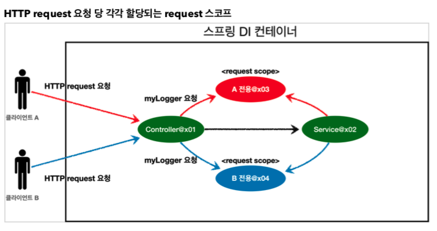
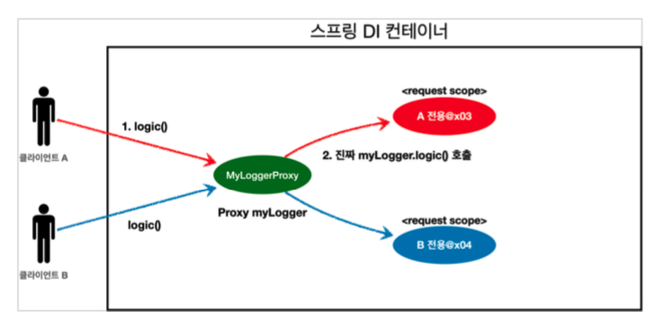

# :book: 스프링 핵심 원리
## :pushpin: 웹 스코프

### 웹 스코프
- 싱글톤은 스프링 컨테이너의 시작과 끝까지 함께하는 매우 긴 스코프
- 프로토타입은 생성과 의존관계 주입, 그리고 초기화까지만 진행하는 특별한 스코프이다.

### 웹 스코프의 특징
- 웹 스코프는 웹 환경에서만 동작한다.
- 웹 스코프는 프로토타입과 다르게 스프링이 해당 스코프의 종료시점까지 관리한다. 따라서 종료 메서드가 호출된다.

### 웹 스코프의 종류
- **request**: HTTP 요청 하나가 들어오고 나갈 때 까지 유지되는 스코프, 각각의 HTTP 요청마다 별도의 빈 인스턴스가 생성되고, 관리된다.
- **session**: HTTP Session과 동일한 생명주기를 가지는 스코프
- **application**: 서블릿 컨텍스트(ServletContext)와 동일한 생명주기를 가지는 스코프
- **websocket**: 웹 소켓과 동일한 생명주기를 가지는 스코프

#### HTTP request 요청 당 각각 할당되는 request 스코프
- 

### 웹 환경 추가
- 웹 스코프는 웹 환경에서만 동작하므로 web 환경이 동작하도록 라이브러리를 추가하자.
```
implementation 'org.spring.framework.boot:spring-boot-starter-web'
```
- 참고: spring-boot-starter-web 라이브러리를 추가하면 스프링 부트는 내장 톰켓 서버를 활용해서 웹 서버와 스프링을 함께 실행시킨다.
- 참고: 스프링부트는 웹 라이브러리가 없으면 우리가 지금까지 학습한 `AnnotationConfigApplicationContext`을 기반으로 애플리케이션을 구동한다.
- 웹 라이브러리가 추가되면 웹과 관련된 추가 설정과 환경들이 필요하므로 `AnnotationConfigServletWebServerApplicationContext`를 기반으로
- 애플리케이션을 구동한다.

- 만약 기본 포트인 8080 포트를 다른 곳에서 사용 중이어서 오류가 발생하면 포트를 변경해야 한다, 9090 포트로 변경하려면 다음 설정을 추가하자
- main/resources/application.properties

```
server.port=9090
```

### request 스코프 예제 개발
- 동시에 여러 HTTP 요청이 오면 정확히 어떤 요청이 남긴 로그인지 구분하기 어렵다. 
- 이럴때 사용하기 딱 좋은 것이 바로 request 스코프이다.
- 기대하는 공통 포멧: [UUID][requestURL]{message}
- UUID를 사용해서 HTTP 요청을 구분하자.
- requestURL 정보도 추가로 넣어서 어떤 URL을 요청해서 남은 로그인지 확인하자.

#### MyLogger

```java
@Component
@Scope(value = "request")
public class MyLogger {

    private String uuid;
    private String requestURL;

    public void setRequestURL(String requestURL) {
        this.requestURL = requestURL;
    }

    public void log(String message) {
        System.out.println("[" + uuid + "]" + "[" + requestURL + "] " + message);
    }

    @PostConstruct
    public void init() {
        uuid = UUID.randomUUID().toString();
        System.out.println("[" + uuid + "] request scope bean create: " + this);
    }
    
    @PreDestroy
    public void close() {
        System.out.println("[" + uuid + "] request scope bean close: " + this);
    }
}
```

- 로그를 출력하기 위한 MyLogger 클래스
- @Scope(value = "request")를 사용해서 request 스코프로 지정했다. 
- 이게 이 빈은 HTTP 요청 당 하나씩 생성되고, HTTP 요청이 끝나는 시점에 소멸된다.
- 이 빈이 생성되는 시점에 자동으로 @PostConstruct 초기화 메서드를 사용해서 uuid를 생성해서 저장해둔다. 
- 이 빈은 HTTP 요청 당 하나씩 생성되므로, uuid를 저장해두면 다른 HTTP 요청과 구분할 수 있다.
- 이 빈이 소멸되는 시점에 @PreDestroy를 사용해서 종료 메시지를 남긴다.
- requestURL은 이 빈이 생성되는 시점에는 알 수 없으므로, 외부에서 setter로 입력받는다.

#### LogDemoController 추가
````java
@Controller
@RequiredArgsConstructor
public class LogDemoController {

    private final LogDemoService logDemoService;
    private final MyLogger myLogger;

    @RequestMapping("log-demo")
    @ResponseBody
    public String logDemo(HttpServletRequest request) {
        String requestURL = request.getRequestURL().toString();
        myLogger.setRequestURL(requestURL);

        myLogger.log("controller test");
        logDemoService.logic("testId");
        return "OK";
    }
}
````
- 로거가 잘 작동하는지 확인하는 테스트용 컨트롤러다.
- 여기서 HttpServletRequest를 통해서 요청 URL을 받았다.
  - requestURL 값 http://localhost:8080/log-demo
- 이렇게 받은 requestURL 값을 myLogger에 저장해둔다. myLogger는 HTTP 요청 당 각각 구분되므로 다른 HTTP 요청때문에 값이 섞이는 걱정은 하지 않아도 된다.
- 컨트롤러에서 contoller test라는 로그를 남긴다.

#### LogDemoService 추가
```java
@Service
@RequiredArgsConstructor
public class LogDemoService {

    private final MyLogger myLogger;

    public void logic(String id) {
        myLogger.log("service id = " + id);
    }
}
```
- 비즈니스 로직이 있는 서비스 계층에서도 로그를 출력해보자.
- 여기서 중요한 점이 있다. request scope를 사용하지 않고 파라미터로 이 모든 정보를 서비스 계층에 넘긴다면, 파라미터가 많아서 지저분해진다.
- 더 문제는 requestURL 같은 웹과 관련된 정보가 웹과 관련없는 서비스 계층까지 넘어가게 된다. 웹과 관련된 부분은 컨트롤러까지만 사용해야 한다.
- 서비스 계층은 웹 기술에 종속되지 않고, 가급적 순수하게 유지하는 것이 유지보수 관점에서 좋다.
- request scope의 MyLoggger 덕분에 이런 부분을 파라미터로 넘기지 않고, MyLogger의 멤버변수에 저장해서 코드와 계층을 
깔끔하게 유지할 수 있다.

#### 애플리케이션 실행 시점에 오류 발생
- 스프링 애플리케이션을 실행시키면 오류가 발생한다. 메시지 마지막에 싱글톤이라는 단어가 나오고...
- 스프링 애플리케이션을 실행하는 시점에 싱글톤 빈은 생성해서 주입이 가능하지만, request 스코프 빈은 아직 생성되지 않는다.
- 이 빈은 실제 고객의 요청이 와야 생성할 수 있다!


### 스코프와 Provider
- 첫번째 해결 방안은 앞서 배운 Provider를 사용하는 것이다.
- 간단히 ObjectProvider를 사용해보자.

#### LogDemoController
```java
@Controller
@RequiredArgsConstructor
public class LogDemoController {

    private final LogDemoService logDemoService;
    private final ObjectProvider<MyLogger> myLoggerProvider;

    @RequestMapping("log-demo")
    @ResponseBody
    public String logDemo(HttpServletRequest request) throws InterruptedException {
        String requestURL = request.getRequestURL().toString();
        MyLogger myLogger = myLoggerProvider.getObject();
        myLogger.setRequestURL(requestURL);

        myLogger.log("controller test");
        Thread.sleep(100);
        logDemoService.logic("testId");
        return "OK";
    }
}
```

### LogDemoService
```java
@Service
@RequiredArgsConstructor
public class LogDemoService {

    private final ObjectProvider<MyLogger> myLoggerProvider;

    public void logic(String id) {
        MyLogger myLogger = myLoggerProvider.getObject();
        myLogger.log("service id = " + id);
    }
}
```

- ObjectProvider 덕분에 ObjectProvider.getObject()를 호출하는 시점까지 request scope 빈의 생성을 지연할 수 있다.
- ObjectProvider.getObject()를 호출하는 시점에는 HTTP 요청이 진행 중이므로 request scope 빈의 생성이 정상 처리된다.
- ObjectProvider.getObject()를 LogDemoController, LogDemoService에서 각각 한번씩 따로 호출해도 같은 HTTP 요청이면 같은 스프링 빈이 반환된다.


### 스코프와 프록시
- 이번에는 프록시 방식을 사용해보자.
```java
@Component
@Scope(value = "request", proxyMode = ScopedProxyMode.TARGET_CLASS)
public class MyLogger {
    
}
```

- 여기가 핵심. proxyMode = ScopedProxyMode.TARGET_CLASS를 추가해주자.
  - 적용 대상이 인터페이스가 아닌 클래스면 TARGET_CLASS를 선택
  - 적용 대상이 인터페이스면 INTERFACES를 선택
- 이렇게 하면 MyLogger의 가짜 프록시 클래스를 만들어두고 HTTP request와 상관없이 가짜 프록시 클래스를 다른 빈에 미리 주입해둘 수 있다.
- 나머지 코드는 Provider 사용 이전으로!

```java
@Controller
@RequiredArgsConstructor
public class LogDemoController {

    private final LogDemoService logDemoService;
    private final MyLogger myLogger;

    @RequestMapping("log-demo")
    @ResponseBody
    public String logDemo(HttpServletRequest request) throws InterruptedException {
        String requestURL = request.getRequestURL().toString();
        myLogger.setRequestURL(requestURL);

        myLogger.log("controller test");
        Thread.sleep(100);
        logDemoService.logic("testId");
        return "OK";
    }
}
```

### 웹 스코프와 프록시 동작 원리
```
System.out.println("myLogger = "  + myLogger.getClass());
```

```
myLogger = class hello.core.common.MyLogger$$EnhancerBySpringCGLIB$$f161d2a
```

#### CGLIB라는 라이브러리로 내 클래스를 상속받은 가짜 프록시 객체를 만들어서 주입한다.
- @Scope의 proxyMode = ScopedProxyMode.TARGET_CLASS를 설정하면 스프링 컨테이너는 CGLIB라는 바이트 코드를 조작하는 라이브러리를 사용해서 MyLogger를 상속받은 가짜 프록시 객체를 생성한다.
- 결과를 확인해보면 우리가 등록한 순수한 MyLogger 클래스가 아니라 MyLogger$$EnhancerBySpringCGLIB 이라는 클래스로 만들어진 객체가 대신 등록된 것을 확인할 수 있다.
- 그리고 스프링 컨테이너에 myLogger라는 이름으로 진짜 대신에 이 가짜 프록시 객체를 등록한다.
- ac.getBean("myLogger", MyLogger.class)로 조회해도 프록시 객체가 조회되는 것을 확인할 수 있다.
- 그래서 의존관계 주입도 이 가짜 프록시 객체가 주입된다.



- 가짜 프록시 객체는 요청이 오면 그때 내부에서 진짜 빈을 요청하는 위임 로직이 들어있다.
- 이 가짜 프록시 빈은 내부에 실제 MyLogger를 찾는 방법을 가지고 있다.
- 클라이언트가 myLogger.logic()을 호출하면 사실은 가짜 프록시 객체의 메서드를 호출한 것이다.
- 가짜 프록시 객체는 내부에 진짜 mylogger를 찾는 방법을 알고 있다.
- 가짜 프록시 객체는 원본 클래스를 상속받아서 만들어졌기 때문에 이 객체를 사용하는 클라이언트 입장에서는 사실 원본인지 아닌지도 모르게, 동일하게 사용할 수 있다(다형성)

#### 동작 정리
- CGLIB라는 라이브러리로 내 클래스를 상속받은 가짜 프록시 객체를 만들어서 주입한다.
- 이 가짜 프록시 객체는 실제 요청이 오면 그때 내부에서 실제 빈을 요청하는 위임 로직이 들어있다.
- 가짜 프록시 객체는 실제 request scope와는 관계가 없다. 그냥 가짜이고, 내부에 단순한 위임 로직만 있고, 싱글톤 처럼 동작한다.

#### 특징 정리
- 프록시 객체 덕분에 클라이언트는 마치 싱글톤 빈을 사용하듯이 편리하게 request scope를 사용할 수 있다.
- 사실 Provider를 사용하든, 프록시를 사용하든 핵심 아이디어는 진짜 객체 조회를 꼭 필요한 시점까지 지연처리 한다는 점이다.
- 단지 애노테이션 설정 변경만으로 원본 객체를 프록시 객체로 대체할 수 있다. 이것이 바로 다형성과 DI 컨테이너가 가진 큰 강점이다.
- 꼭 웹 스코프가 아니어도 프록시는 사용할 수 있다.

#### 주의점
- 마치 싱글톤을 사용하는 것 같지만 다르게 동작하기 때문에 결국 주의해서 사용해야 한다.
- 이런 특별한 scope는 꼭 필요한 곳에만 최소화해서 사용하자. 무분별하게 사용하면 유지보수하기 어려워진다.