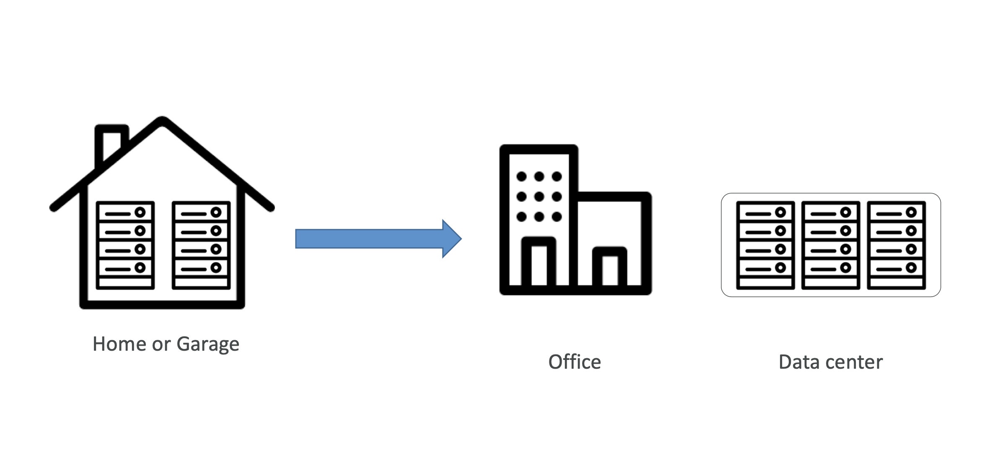

## AWS Certified Cloud Course (CLF-C01)

### :pushpin: 클라우드 컴퓨팅이란?
#### How websites work
- Client - network - Server
- Clients have IP addresses
- Servers have IP addresses
- Jusk like when you're sending post mail!

#### What is a server composed of?
- Compute: CPU
- Memory: RAM
- Storage: Data
- Database: Store data in a structured way
- Network: Routers, switch, DNS server

#### IT Terminology
- Network: cables, routers and servers connected with each other
- Router: A networking device that forwards data packets between computer networks. They know where to send your packets on the internet!
- Switch: Takes a packet and send it to the correct server / client on your network

#### Traditionally, how to build infrastructure

#### Problems with traditional IT approach
- Pay for the rent for the data center
- Pay for power supply, cooling, maintenance
- Adding and replacing hardware takes time
- Scaling is limited
- Hire 24/7 team to monitor the infrastructure
- How to deal with disaster? (earthquake, power shutdown, fire...)
- Can we externalize all this?

#### What is Cloud Computing?
- Cloud computing is the `on-demand delivery`of compute power, database storage, applications, and other IT resources
- Through a cloud services platform with pay-as-you-go pricing
- You can provision exactly the right type and size of computing resources you need
- You can access as many resources as you need, almost instantly
- Simple way to access servers, storage, databases and a set of application services
- Amazon Web Services owns and maintains the network-connected hardware required for these application services, while you provision and use what you need via a web application.