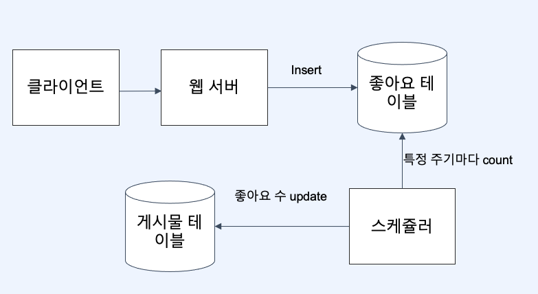

# :book: 백엔드 개발자를 위한 대용량 데이터 & 트래픽 처리
## :pushpin: Chapter 13. 동시성 제어하기
### :seedling: 읽기와 쓰기의 트레이드 오프

### 좋아요 구현
1. 게시물에 컬럼 추가를 통한 구현 - 비관적 락
2. 게시물에 컬럼 추가를 통한 구현 - 낙관적 락
3. 좋아요 테이블 추가를 통한 구현

### 컬럼을 통한 구현
1. 조회시 컬럼만 읽어오면 됨
2. 쓰기시 게시물 레코드에 대한 경합이 발생
-> 하나의 자원(게시물)을 두고 락 대기
3. 같은 회원이 하나의 게시물에 대해 여러 번 좋아요를 누를 수 있음

### 좋아요 테이블을 통한 구현
1. 조회시 매번 count 쿼리 연산
2. 쓰기시 경합없이 인서트만 발생
3. 회원정보 등 다양한 정보 저장 가능 

### 병목 해소하기
- 쓰기 지점의 병목은 하나의 레코드를 점유
- 조회 지점의 병목은 카운트 쿼리
- 좋아요 수는 높은 정합성을 요구하는 데이터인가?

- 내가 누른 좋아요가 곧 바로 반영이 될까?
- 데이터의 성질, 병목지점 등을 파악하고, 적당한 기술들을 도입해 해소

### 강의를 끝내고
- Repository Layer를 JPA로 리팩토링
- 팔로워가 100만명인 유저의 게시물 작성 성능 테스트
  - 비동기 큐를 통해 개선
  - Mixed Push / Pull Model
- 로그인 / 팔로우 승인, 취소 / 댓글 구현
- MySQL Master / Slave
- 파티셔닝 