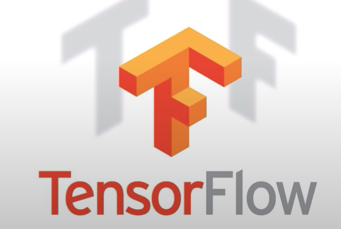

## :book: 모두를 위한 딥러닝 


### TensorFlow



- TensorFlow is an open source software library for numerical computation 
using data flow graph.
- Python!


### What is a Data Flow Graph?


- Nodes in the graph represent mathematical operations
- Edges represent the multidimensional data arrays(tensors) communicated between them.


### Installing TensorFlow

- Linux, Mac OSX, Windows
    - (sudo -H) pip install --upgrade tensorflow
    - (sudo -H) pip install --upgrade tensorflow-gpu

- From source
    - bazel..
    
 
- Check installation and version


### TensorFlow Mechanics


1. Build graph using TensorFlow operations
2. feed data and run graph (operation) sess.run(op)
3. update variables in the graph (and return values)


### Everything is Tensor

- Tensor

````
[1., 2., 3.]
[[1., 2., 3.], [4., 5., 6.]]
[[[1., 2., 3.]], [[7., 8., 9.]]]
````


### Tensor Ranks, Shapes, and Types

Rank | Math entity | Python example
----| ----| ----|
0 | Scalar(magnitude only) | s = 483
1 | Vector(magnitude and direction) | v = [1.1, 2.2, 3.3]
2 | Matrix(table of numbers) | m = [[1,2,3], [4,5,6], [7,8,9]]
3 | 3-Tensor (cube of numbers) | t = [[[2], [4], [6]], [[8],[10],[12]], [[14],[16],[18]]
4 | n-Tensor (you get idea) } ...