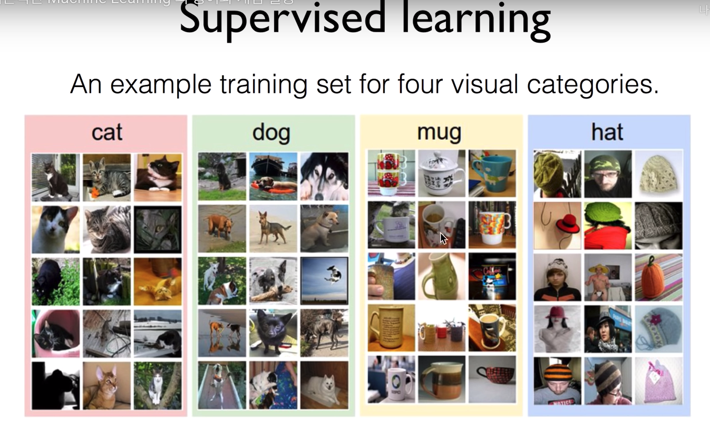

## 모두를 위한 딥러닝

### Goal

- Basic understanding of machine learning algorithms
    - Linear regression, Logistic regression (classification)
    - Neural networks, Convolutional Neural Network, Recurrent Neural Network

- Solve your problems using machine learning tools 
    - Tensorflow and Python

### Machine Learning

- Limitations of explicit programming
    - Spam filter: many rules
    - Automatic driving: too many rules
   
- Machine learning 

> Field of study that gives computers the ability to learn without being
explicitly programmed   - Arthur Samuel (1959)

### Supervised / Unsupervised learning

- Supervised learning
    - learning with labeled examples - training set
    

- Unsupervised learning : un-labeled data
    - Google news grouping
    - Word clustering
    
    
### Supervised learning

- Most common problem type in ML
    - Image labeling: learning from tagged images
    - Email spam filter: learning from labeled (spam or ham) email
    - Predicting exam score: learning from previous exam score and time spent
    

### Training data set

### Types of supervised learning

- Predicting final exam score based on time spent 
    - regression
- Pass/non-pass based on time spent
    - binary classification
- Letter grade (A,B,C,E and F) based on time spent 
    - multi-label classification
    