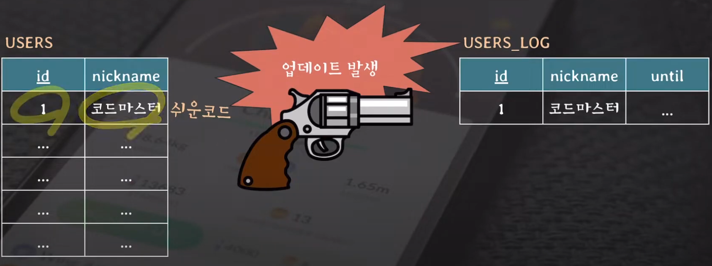

## :pushpin: 인프런 시니어 백엔드 개발자가 알려주는 데이터베이스 개론 & SQL

### :seedling: Trigger의 사전적 의미
1. (총의) 방아쇠
2. (반응사건을 유발한) 계기 [도화선]
3. 촉발시키다 (=set off)
4. 작동시키다 (=set off)

### :seedling: SQL에서 Trigger란?
> 데이터에 변경이 생겼을 때 즉, DB에 insert, update, delete가 발생했을 때 이것이 계기가 되어 
> 자동적으로 실행되는 프로시저(procedure)를 의미

### SQL에서 Trigger 예시
사용자의 닉네임 변경 이력을 저장하는 트리거를 작성해보자


```mysql
delimiter $$
create trigger log_user_nickname_trigger
before update
on users for each row
begin 
    insert into users_log values(OLD.id, OLD.nickname, now());
end $$
delimiter ;
```

- OLD: update되기 전의 tuple을 가리킴. delete된 tuple을 가리킴

사용자가 마트에서 상품을 구매할 때마다 지금까지 누적된 구매 비용을 구하는 트리거를 작성해보자
```mysql
delimiter $$
create trigger sum_buy_prices_trigger
after insert
on buy for each row
begin 
    declare total int;
    declare user_id int default new.user_id
    
    select sum(price) into total from buy where user_id = user_id;
    update user_buy_stats set price_sum = total where user_id = user_id;
end $$
delimiter ;
```

- NEW: insert된 tuple을 가리킴. update된 후의 tuple을 가리킴

### 이외에도 trigger를 정의할 때 알고 있으면 좋은 내용 - 1
- update, insert, delete 등을 한번에 감지하도록 설정 가능하다 (MySQL은 불가능)

postgresql
```postgresql
create trigger avg_empl_salary_trigger
after insert or update or delete
on employee
for each row
execute function update_avg_empl_salary();
```

#### FOR EACH ROW
```postgresql
update employee set salary = 1.5 * salary where dept_id = 1003;
```
- 1003 부서에 임직원이 다섯명이 있다면 avg_empl_salary_trigger는 다섯번 실행된다

#### FOR EACH STATEMENT
- 1003 부서에 임직원이 다섯명이 있어도 avg_empl_salary_trigger는 한번만 실행된다

### 이외에도 trigger를 정의할 때 알고 있으면 좋은 내용 - 2
- row 단위가 아니라 statement 단위로 trigger가 실행될 수 있도록 할 수 있다 (MySQL은 FOR EACH STATEMENT 사용 불가능)

### 이외에도 trigger를 정의할 때 알고 있으면 좋은 내용 - 3
- trigger를 발생시킬 디테일한 조건을 지정할 수 있다 (MySQL은 불가능)

postresql
```postgresql
create trigger log_user_nickname_trigger
before update
on users
for each row
when (new.nickname is distinct from old.nickname)
execute function log_user_nickname();
```

### trigger 사용 시 주의 사항
- 소스코드로는 발견할 수 없는 로직이기 때문에 어떤 동작이 일어나는지 파악하기 어렵고 문제가 생겼을 때 대응하기 어렵다
- 가시적이지 않아서 개발도 관리도 문제 파악도 힘들어진다
- 과도한 트리거 사용은 DB에 부담을 주고 응답을 느리게 만든다
- 디버깅이 어렵다
- 문서 정리가 특히나 중요하다

### trigger에 대한 개인적인 생각
- 트리거는 최후의 카드로 남겨놓는 것이 어떨까...

