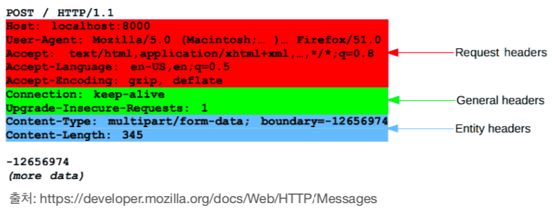
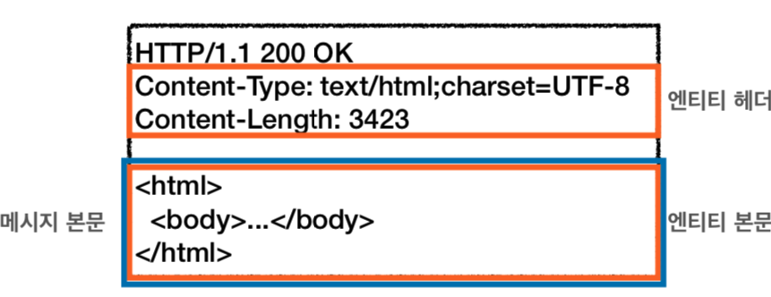
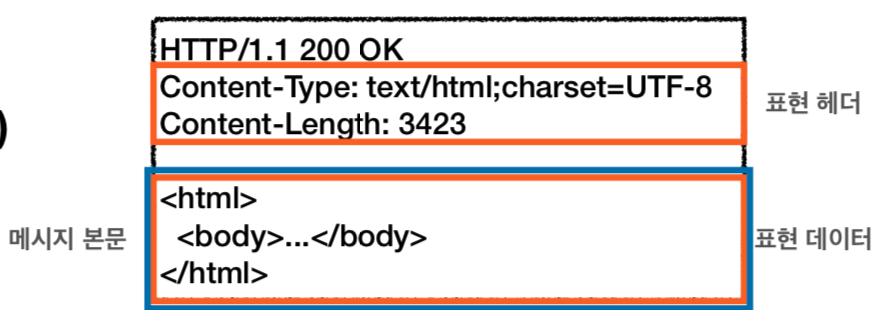
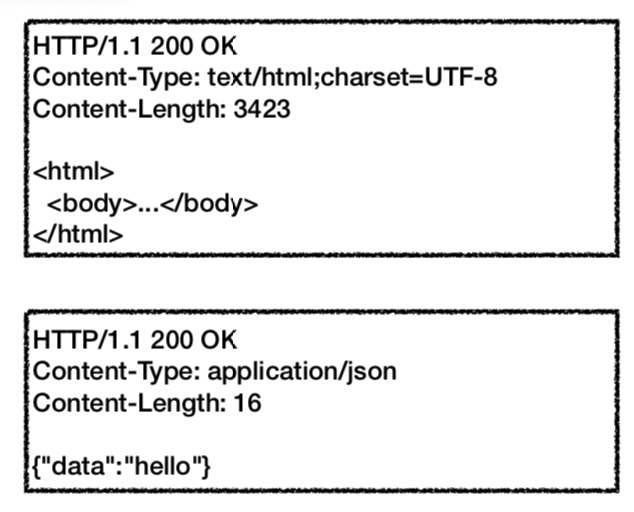
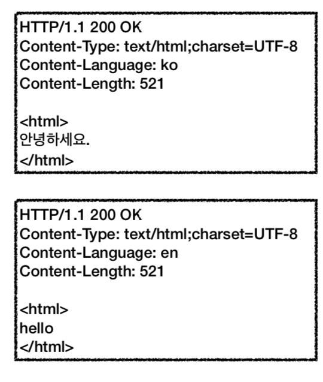
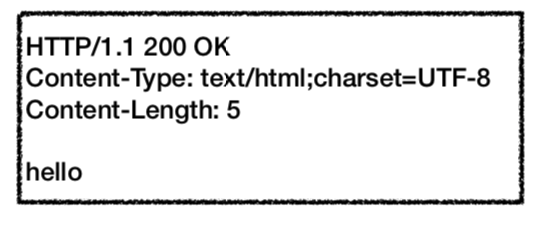

# :book: 모든 개발자를 위한 HTTP 웹 기본 지식
## :pushpin: HTTP 헤더

### HTTP 헤더
- header-field = field-name ":" OWS field-value OWS (OWS: 띄어쓰기 허용)
- field-name은 대소문자 구문 없음


### HTTP 헤더 용도
- HTTP 전송에 필요한 모든 부가 정보
  - 예) 메시지 바디의 내용, 메시지 바디의 크기, 압축, 인증, 요청 클라이언트, 서버 정보, 캐시 관리 정보...
- 표준 헤더가 너무 많음
- 필요시 임의의 헤더 추가 가능
  - helloworld: hihi

### HTTP 헤더 분류 - RFC2616 (과거)



- 헤더 분류
  - General 헤더: 메시지 전체에 적용되는 정보, 예) Connection: close
  - Request 헤더: 요청 정보, 예) User-Agent: Mozilla/5.0 (Macintosh; ..)
  - Response 헤더: 응답 정보, 예) Server: Apache
  - Entity 헤더: 엔티티 바디 정보, 예) Content-Type: text/html, Content-Length: 3423

### HTTP BODY message body - RFC2616 (과거)



- 메시지 본문(message body)은 엔티티 본문(entity body)을 전달하는데 사용
- 엔티티 본문은 요청이나 응답에서 전달할 실제 데이터
- 엔티티 헤더는 엔티티 본문의 데이터를 해석할 수 있는 정보 제공
  - 데이터 유형(html, json), 데이터 길이, 압축 정보 등등

### 그런데...
- HTTP 표준
- 1999년 RFC2616 X (폐기됨)
- 2014년 RCF7230 ~ 7235 등장

### RFC723x 변화
- 엔티티(Entity) -> 표현(Representation)
- Representation = representation Metadata + Representation Data
- 표현 = 표현 메타데이터 + 표현 데이터

### HTTP BODY message body - RFC7230 (최신)



- 메시지 본문(meesage body)을 통해 표현 데이터 전달
- 메시지 본문 = 페이로드(payload)
- 표현은 요청이나 응답에서 전달할 실제 데이터
- 표현 헤더는 표현 데이터를 해석할 수 있는 정보 제공
  - 데이터 유형(html, json), 데이터 길이, 압축 정보 등등
- 참고: 표현 헤더는 표현 메타데이터와 페이로드 메시지를 구분해야 하지만 여기서는 생략


### 표현
```
HTTP/1.1 200 OK
Content-Type: text/html;charset=UTF-8
Content-Length: 3423

<html>
  <body>...</body>
</html>
```

- Content-Type: 표현 데이터의 형식
- Content-Encoding: 표현 데이터의 압축 방식
- Content-Language: 표현 데이터의 자연 언어
- Content-Length: 표현 데이터의 길이
- 표현 헤더는 전송, 응답 둘 다 사용

### Content-Type
#### 표현 데이터의 형식 설명



- 미디어 타입, 문자 인코딩
- 예)
  - text/html; charset=utf-8
  - application/json
  - image/png

### Content-Encoding
#### 표현 데이터 인코딩


- 표현 데이터를 압축하기 위해 사용
- 데이터를 전달하는 곳에서 압축 후 인코딩 헤더 추가
- 데이터를 읽는 쪽에서 인코딩 헤더의 정보로 압축 해제
- 예)
  - gzip
  - deflate
  - identity

### Content-Language
#### 표현 데이터의 자연 언어



- 표현 데이터의 자연 언어를 표현
- 예)
  - ko
  - en
  - en-US

### Content-Length
#### 표현 데이터의 길ㅇ



- 바이트 단위
- Transfer-Encoding(전송 코딩)을 사용하면 Content-Length를 사용하면 안됨


### 협상(콘텐츠 네고시에이션)
#### 클라이언트가 선호하는 표현 요청

- `Accept`: 클라이언트가 선호하는 `미디어 타입` 전달
- `Accept-Charset`: 클라이언트가 선호하는 `문자 인코딩`
- `Accept-Encoding`: 클라이언트가 선호하는 `압축 인코딩`
- `Accept-Language`: 클라이언트가 선호하는 `자연 언어`
- 협상 헤더는 `요청 시`에만 사용


### Accept-Language 적용 전


### Accept-Language 적용 후


### 협상과 우선순위 1
#### Quality Values(q)
- `Quality Values(q)` 값 사용
- `0~1`, `클수록 높은 우선 순위`
- 생략하면 1
- Accept-Language: ko-KR,ko;q=0.9,en-US;q=0.8,en;q=0.7
    - ko-KR;q=1 (q생략)
    - ko;q=0.9
    - en-US;q=0.8
    - en:q=0.7
    
### 협상과 우선순위 2
#### Quality Values(q)

- 구체적인 것이 우선한다.

### 협상과 우선순위 3
#### Quality Values(q)

- 구체적인 것을 기준으로 미디어 타입을 맞춘다.