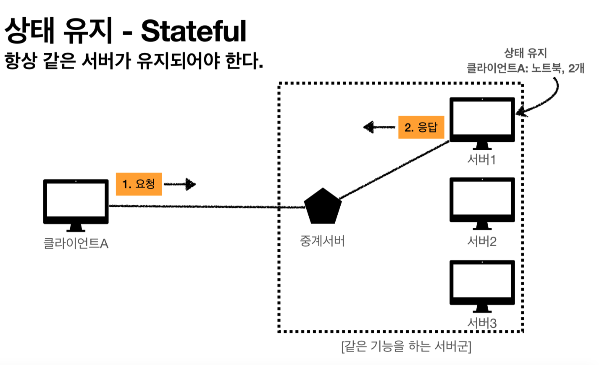
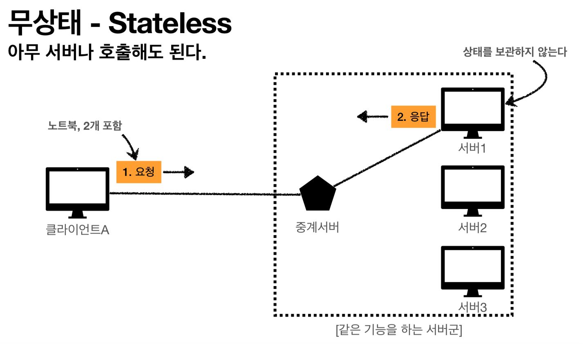

# :book: 모든 개발자를 위한 HTTP 웹 기본 지식

## :pushpin: HTTP

### HTTP (HyperText Transfer Protocol)

- 모든 것이 HTTP
- 클라이언트 서버 구조
- Stateful, Stateless
- 비 연결성(connectionless)
- HTTP 메시지

### 모든 것이 HTTP
> HTTP 메시지에 모든 것을 전송

- HTML, TEXT
- IMAGE, 음성, 영상, 파일
- JSON, XML (API)
- 거의 모든 형태의 데이터 전송 가능
- 서버간에 데이터를 주고 받을 때도 대부분 HTTP tkdyd
- 지금은 HTTP 시대!

### HTTP 역사
- HTTP/0.9 1991년: GET 메서드만 지원, HTTP 헤더 X
- HTTP/1.0 1996년: 메서드, 헤더 추가
- HTTP/1.1 1997년: 가장 많이 사용, 우리에게 가장 중요한 버전
  - RFC2068 (1997) -> RFC2616(1999) -> RFC7230~7235 (2014)
- HTTP/2 2015년: 성능 개선
- HTTP/3 진행중: TCP 대신에 UDP 사용, 성능 개선

### 기반 프로토콜
- TCP: HTTP/1.1, HTTP/2
- UDP: HTTP/3
- 현재 HTTP/1.1 주로 사용
  - HTTP/2, HTTP/3 도 점점 증가

### HTTP 특징
- 클라이언트 서버 구조
- 무상태 프로토콜(스테이스리스), 비연결성
- HTTP 메시지
- 단순함, 확장 가능

### 클라이언트 서버 구조
- Request Response 구조
- 클라이언트는 서버에 요청을 보내고, 응답을 대기
- 서버가 요청에 대한 결과를 만들어서 응답

### 무상태 프로토콜 
> 스테이스리스(Stateless)

- 서버가 클라이언트의 상태를 보존X
- 장점: 서버 확장성 높음 (스케일 아웃)
- 단점: 클라이언트가 추가 데이터 전송

## Stateful, Stateless 차이

### 상태 유지 - Stateful

- 고객: 이 노트북 얼마인가요?
- 점원: 100만원 입니다.(노트북 상태 유지)

- 고객: 2개 구매하겠습니다.
- 점원: 200만원 입니다. 신용카드, 현금 중에 어떤 걸로 구매하시겠어요? (노트북, 2개 상태 유지)

- 고객: 신용카드로 구매하겠습니다.
- 점원: 200만원 결제 완료되었습니다. (노트북, 2개, 신용카드 상태 유지)

### 무상태 - Stateless

- 고객: 이 노트북 얼마인가요?
- 점원: 100만원 입니다.

- 고객: 노트북 2개 구매하겠습니다.
- 점원: 노트북 2개는 200만원 입니다. 신용카드, 현금 중에 어떤 걸로 구매하시겠어요?

- 고객: 노트북 2개를 신용카드로 구매하겠습니다.
- 점원: 200만원 결제 완료되었습니다.

### 무상태 - Stateless, 점원이 중간에 바뀌면?

- 고객: 이 노트북 얼마인가요?
- 점원A: 100만원 입니다.

- 고객: 노트북 2개 구매하겠습니다.
- 점원B: 노트북 2개는 200만원 입니다. 신용카드, 현금 중에 어떤 걸로 구매하시겠어요?

- 고객: 노트북 2개를 신용카드로 구매하겠습니다.
- 점원C: 200만원 결제 완료되었습니다.

### Stateful, Stateless 차이

- **상태 유지**: 중간에 다른 점원으로 바뀌면 안된다. (중간에 다른 점원으로 바뀔 때 상태 정보를 다른 점원에게 미리 알려줘야 한다)
- **무상태**: 중간에 다른 점원으로 바뀌어도 된다.
  - 갑자기 고객이 증가해도 점원을 대거 투입할 수 있다.
  - 갑자기 클라이언트 요청이 증가해도 서버를 대거 투입할 수 있다.
- 무상태는 응답 서버를 쉽게 바꿀 수 있다. -> 무한한 서버 증설 가능 

### 상태 유지 

### 무상태

### Stateless 실무 한계

- 모든 것을 무상태로 설계할 수 있는 경우도 있고 없는 경우도 있다.
- 무상태
  - 예) 로그인이 필요없는 단순한 서비스 소개 화면
- 상태 유지
  - 예) 로그인
- 로그인한 사용자의 경우 로그인 했다는 상태를 서버에 유지
- 일반적으로 브라우저 쿠키와 서버 세션 등을 사용해서 상태 유지
- 상태 유지는 최소한만 사용