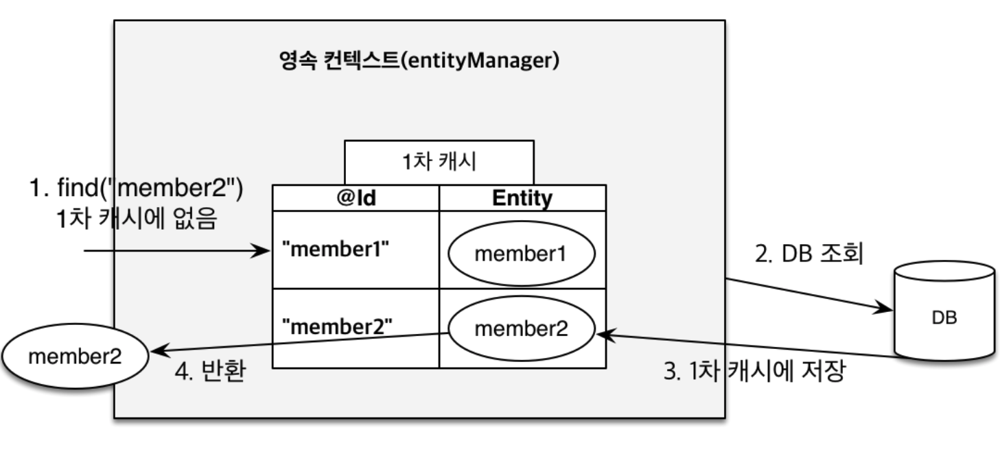

# :book: selab-study
## :pushpin: Topic. JPA 1차 캐시

### JPA 1차 캐시

▶ 영속성
- 영속성은 쉽게 말하면 지속을 의미
- 즉 엔티티를 사용하고 저장을 해서 지속적으로 사용하며 얻는 이점을 얻는다.
- 예를 들어서 JPA에서 repository.findOne을 이용해 동일한 데이터에 대해 조회를 3번 요청한다. 하지만 DB의 쿼리나 JPA 로그를 보면 SELECT 문이 1번만 실행된다.
- 그 이유가 영속성 때문으로 첫번째 SELECT한 결과를 JPA의 1차 캐시에 보관하고 계속 재사용하기 때문이다.

▶ 1차 캐시
- 1차 캐시는 EntityManager가 관리하는 영속성 컨텍스트 내부에 있는 첫번째 캐시


```
Member member = new Member();
member.setId("member1");
member.setUsername("회원1");

// 1차 캐시에 저장됨
em.persist(member);

// 1차 캐시에서 조회
Member findMember = em.find(Member.class, "member1");
```

▶ 1차 캐시의 조회 동작은 아래와 같다.
1. 조회 시 1차 캐시에 데이터가 이미 있는지 확인하고 데이터가 있으면 가져온다. (비교는 PK로 한다)
2. 1차 캐시에 데이터가 없다면 데이터베이스에 데이터를 요청한다.
3. 데이터베이스에서 받은 데이터를 다음에 재사용할 수 있도록 1차 캐시에 저장한다.

▶ Q) Update가 발생하면 데이터가 갱신될텐데, 계속 캐시에 있는 것을 조회하면 과거의 데이터만 받는건 아닌지? 
A) 1차 캐시는 영속성 컨텍스트 내부에 있음. 영속성 컨텍스트 내부에 있는 엔티티의 변화가 즉시 1차 캐시에 저장되기 때문에 캐시에서 갱신된 데이터를 받게됨