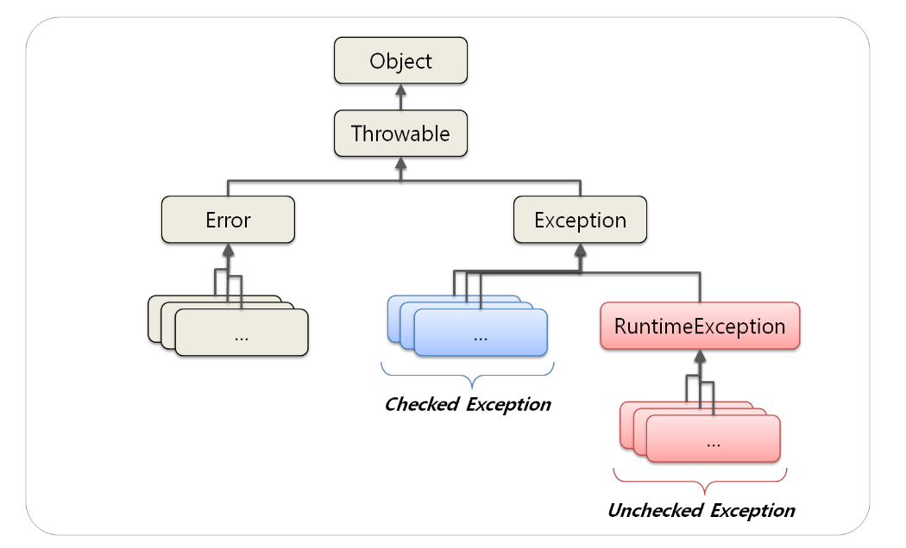

# :book: selab-study 
## :pushpin: Topic. Checked Exception VS Unchecked Exception

### 오류(Error)와 예외(Exception)

먼저 오류(Error)와 예외(Exception)의 개념부터 정리해보자.

▶ 오류
- 오류(Error)는 시스템에 비정상적인 상황이 생겼을때 발생함
- 시스템 레벨에서 발생하기 때문에 심각한 수준의 오류
- 따라서 개발자가 미리 예측하여 처리할 수 없기 때문에 애플리케이션에서 오류에 대한 처리를 신경쓰지 않아도 됨

▶ 예외
- 예외(Exception)은 개발자가 구현한 로직에서 발생함 
- 프로그래밍에서 예외란 입력 값에 대한 처리가 불가능하거나, 프로그램 실행 중에 참조된 값이 잘못된 경우 등 
정상적인 프로그램의 흐름에 어긋나는 경우 
- 예외는 개발자가 직접 처리할 수 있기 때문에 예외 상황을 미리 예측하여 핸들링할 수 있음

### Exception Class 계층

- 위 그림 예시는 예외클래스 구조임
- 모든 예외클래스는 Throwable 클래스를 상속받고 있으며 Throwable은 최상위 클래스 Object의 자식 클래스
- Throwable을 상속받는 클래스는 Error와 Exception이 있음
- Exception은 수많은 자식 클래스들을 가지고 있는데 그 중 RuntimeException에 주목해야함
- RuntimeException은 CheckedException과 uncheckedException을 구분하는 기준이며 Exception의 자식 클래스 중 RuntimeExcepton을 제외한
모든 클래스는 CheckedException이며, RuntimeException과 그의 자식 클래스들은 Unchecked Exception이라 부름

### Checked Exception

- 명시적인 예외 처리를 강제하기 때문에 Checked Exception이라고 함
- 반드시 try ~ catch로 예외를 잡거나 throw로 호출한 메소드에게 예외를 던져야 함
- Exception 처리 코드를 compiler가 check
- ex) IOException, ClassNotFoundException 등

### Unchecked Exception

- 배열의 범위를 벗어난다거나(IndexOutOfBoundsException) 값이 null인 참조변수의 멤버를 호출하거나 (NullPointerXception) 
클래스 간의 형 변환을 잘못했다던가 (ClassCastException) 정수를 0으로 나누려 했다거나 (ArithmeticException)하는 경우에 발생하는 예외들
- 컴파일하는데 문제없지만 실행하면 문제가 발생함
- 명시적인 예외 처리를 강제하지 않기 때문에 Unchecked Exception이라고 함
- 명시적인 예외 처리란 try ~ catch로 잡거나 throw로 호출한 메소드에게 예외를 던지지 않는 행위를 말함 
- 등 NullPointerException, ClassCastException 등

|    |Checked Exception|Unchecked Exception|
|----|---|----|
|처리 여부|반드시 예외를 처리해야함|명시적인 처리를 강제하지 않음|
|확인 시점|컴파일 단계|실행단계
|예외 발생시 트랜잭션 처리|roll-back하지 않음|roll-back함
|대표 예외|Exception을 상속받는 하위 클래스 중 RuntimeException을 제외한 모든 예외(대표적으로 IOException, SQLException)|RuntimeException 하위 예외 (대표적으로 NullPointerException, IllegalArgumentException, IndexOutOfBoundException, SystemException)

- Checked Exception과 Unchecked Excepion의 가장 명확한 구분 기준은 `꼭 처리를 해야 하느냐`임
- Checked Exception이 발생할 가능성이 있다면 반드시 try/catch로 감싸거나 throw로 던져서 처리해야함
- 반면 Unchecked Exception은 명시적인 예외 처리를 하지 않아도됨. 이 예외는 피할 수 있지만 개발자가 부주의해서 발생하는 경우가 대부분이고 
미리 예측하지 못했던 상황에서 발생하는 예외가 아니기 때문에 굳이 로직으로 처리할 필요는 없음

- 또한 `예외를 확인할 수 있는 시점`에서도 구분할 수 있음
- 일반적으로 컴파일 단계에서 명확하게 Exception 체크가 가능한 것을 Checked Exception이라고 함
- 컴파일 단계에서 확인할 수 없는 예외는 Unchecked Exception이며 실행 과정 중 발견된다해서 Runtime Exception이라 함

- 마지막으로 예외 발생 시 `트랜잭션의 roll-back 여부`에 따라 구분할 수 있다. 
- 기본적으로 Checked Exception은 예외가 발생하면 트랜잭션을 roll-back하지 않고 예외를 던져줌
- 하지만 Unchecked Exception은 에외 발생 시 트랜잭션을 roll-back한다는 점에서 차이가 있다.
- 트랜잭션의 전파방식 즉 어떻게 묶어놓느냐에 따라 robll-back이 되는 범위가 달라지기 때문에 이를 인지하고 트랜잭션 전파방식과 롤백 규칙등을 적절히 사용해야함

#### 참고 글
- https://joswlv.github.io/2018/10/29/java_exception/
- https://steady-coding.tistory.com/583
- https://www.nextree.co.kr/p3239/