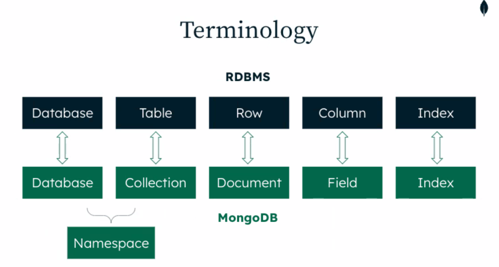

# :book: MongoDB
## :pushpin: Topic. MongoDB

### Why a new Database?
- Data: Volume, Velocity, Variety
- Time: Iterative, Agile, Short Cycles
- Risk: Always-on, Global, Scale
- Cost: Open Source, Cloud, Pay by Usage

### MongoDB
- Modern Document-model Database.
- Designed to back the modern-day business applications.
    - Developer and Operations oriented
    - Easy to scale horizontally
    - Business Critical
    - Lessons learned from 50 years of RDBMS

### Terminology

###  What is different in MongoDB
- You can Query with SQL but normally don't
    - Interaction is from code using Object-based APIs
    - Rather than constructing SQL Strings
    - SQL is used only to enable third-party BI tools.

- Documents/Objects are first-order data types
    - Data modeling/Schema design is done differently
    - Dynamic schemas can be used if desired
- The primary key field is always called _id

### MongoDB Database

- MongoDB's original product: A Document model
    - Similarities to RDBMS
    - BSON not JSON - Data stored as binary typed objects
    - Container types: Document and Array
    - Fewer 'tables', more denormalization
    - 3rd normal form isn't optimal in many cases.
    - Optimized for Availability, Usability, Scailing, and Speed
    - Idiomatic development drivers

