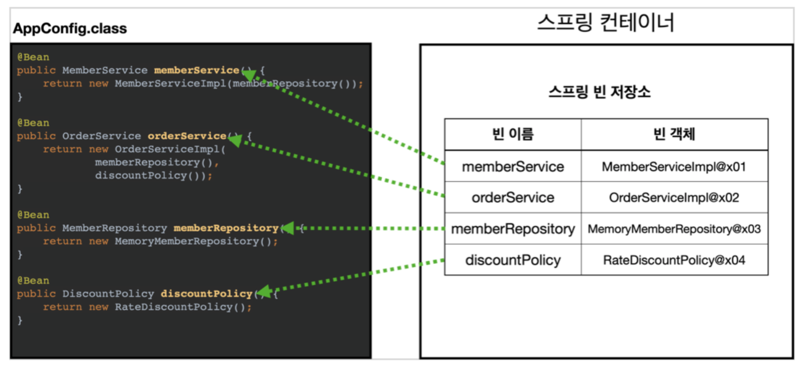

# :book: 스프링 핵심 원리

## :pushpin: 스프링 컨테이너와 스프링 빈

### 스프링 컨테이너 생성

```
// 스프링 컨테이너 생성
ApplicationContext applicationContext =
                        new AnnotationConfigApplicationContext(AppConfig.class);
```

- `ApplicationContext`를 스프링 컨테이너라 한다.
- `ApplicationContext`는 인터페이스이다.
- 스프링 컨테이너는 XML을 기반으로 만들 수 있고, 애노테이션 기반의 자바 설정 클래스로 만들 수 있다.
- 직전에 AppConfig를 사용했던 방식이 애노테이션 기반의 자바 설정 클래스로 컨테이너를 만든 것이다.
- 자바 설정 클래스를 기반으로 스프링 컨테이너(ApplicationContext)를 만들어보자.
    - new AnnotationCOnfigApplicationContext(AppConfig.class);
    - 이 클래스는 ApplicationContext 인터페이스의 구현체이다.
    
> 참고: 더 정확히는 스프링 컨테이너를 부를 때 BeanFactory, ApplicationContext로 구분해서 
> 이야기한다. BeanFactory를 직접 사용하는 경우는 거의 없으므로 일반적으로 ApplicationContext를
> 스프링 컨테이너라 한다.


### 스프링 컨테이너의 생성 과정

1. 스프링 컨테이너 생성


- new AnnotationConfigApplicationContext(AppConfig.class)
- 스프링 컨테이너를 생성할 때는 구성 정보를 지정해주어야 한다.
- 여기서는 AppConfig.class를 구성 정보로 지정했다.

