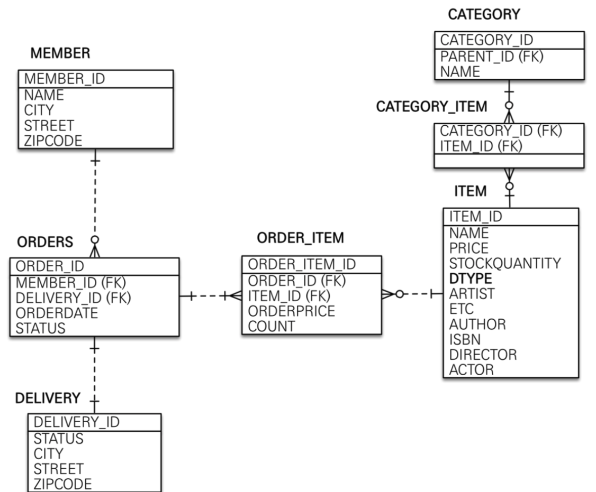

# :book: 실전! 스프링 부트와 JPA 활용

## :pushpin: 살전! 스프링 부트와 JPA 활용

### 도메인 모델과 테이블 설계

- 회원, 주문, 상품의 관계: 회원은 여러 상품을 주문할 수 있다.
그리고 한번 주문할 때 여러 상품을 선택할 수 있으므로 주문과 상품은 다대다 관계다.
하지만 이런 다대다 관계는 관계형 데이터베이스는 물론이고 엔티티에서도 거의 사용하지 않는다.
따라서 그림처럼 주문상품이라는 엔티티를 추가해서 다대다 관계를 일대다, 다대일 관계로 풀어냈다.
- 상품 분류: 상품은 도서, 음반, 영화로 구분되는데 상품이라는 공통 속성을 사용하므로 상속 구조로 표현했다.

### 회원 엔티티 분석

- 회원(Member): 이름과 임베디드 타입인 주소(Address), 그리고 주문(orders) 리스트를 가진다.

- 주문(Order): 한 번 주문시 여러 상품을 주문할 수 있으므로 주문과  주문상품(OrderItem)은 일대다 관계다.
주문은 상품을 주문한 회원과 배송 정보, 주문 날짜, 주문 상태(status)를 가지고 있다. 주문 상태는 열거형을
사용했는데 주문(ORDER), 취소(CANCEL)을 표현할 수 있다.

- 주문상품(OrderItem): 주문한 상품 정보와 주문 금액(orderPrice), 주문 수량(count) 정보를 가지고 있다.
  (보통 OrderLine, LineItem으로 많이 표현한다)

- 상품(Item): 이름, 가격, 재고수량(stockQuantity)을 가지고 있다. 상품을 주문하면 재고 수량이 줄어든다.
상품의 종류로는 도서. 음반, 영화가 있는데 각각은 사용하는 속성이 조금씩 다르다.

- 배송(Delivery: 주문시 하나의 배송 정보를 생성한다. 주문과 배송은 일대일 관계다.

- 카테고리(Category): 상품과 다대다 관계를 맺는다. parent, child로 부모, 자식 카테고리를 연결한다.

- 주소(Address): 값 타입(임베디드 타입)이다. 회원과 배송(Delivery)에서 사용한다.

### 회원 테이블 분석

- 관계형 데이터베이스에서는 다대다 관계 매핑이 안되기 때문에 중간에 CATEGORY_ITEM이라는 매핑 테이블을 두고 다대다 관계를 
일대다, 다대일 관계로 풀어냄

### 연관관계 매핑 분석
- 회원과 주문: 일대다, 다대일의 양방향 관계다. 따라서 연관관계의 주인을 정해야하는데, 외래 키가 있는 주문을 연관관계의 주인으로 정하는 것이 좋다.
그러므로 Order.member를 ORDERS.MEMBER_ID 외래키와 매핑한다.

> **참고: 외래키가 있는 곳을 연관관계의 주인으로 정해라**
> 연관관계의 주인은 단순히 외래 키를 누가 관리하냐의 문제이지 비즈니스상 우위에 있다고 주인으로 정하면 안된다.
> 예를 들어서 자동차와 바퀴가 있으면, 일대다 관계에서 항상 다쪽에 외래 키가 있으므로 외래 키가 있는 바퀴를 
연관관계의 주인으로 정하면 된다. 물론 자동차를 연관관계의 주인으로 정하는 것이 불가능한 것은 아니지만, 자동차를
> 연관관계의 주인으로 정하면 자동차가 관리하지 않는 바퀴 테이블의 외래 키 값이 업데이트되므로 관리와 
> 유지보수가 어렵고 추가적으로 별도의 업데이트 쿼리가 발생하는 성능 문제도 있다.

### 엔티티 클래스 개발
- 실무에서는 가급적 `Getter`는 열어두고, `Setter`는 꼭 필요한 경우에만 사용하는 것을 추천

> 이론적으로 Getter, Setter 모두 제공하지 않고 꼭 필요한 별도의 메서드를 제공하는게 가장 이상적이다.
> 하지만 실무에서 엔티티의 데이터는 조회할 일이 너무 많으므로, Getter의 경우 모두 열어두는 것이 편리하다.
> Getter는 아무리 호출해도 호출하는 것만으로 어떤 일이 발행하지 않는다.
> 하지만 Setter는 문제가 다르다. Setter를 호출하면 데이터가 변한다. 
> Setter를 막 열어두면 가까운 미래에 엔티티가 도대체 왜 변경되는지 추적하기 점점 힘들어진다. 
> 그래서 엔티티를 변경할 때는 Setter 대신에 변경 지점이 명확하도록 변경을 위한 비즈니스 메서드를 별도로 제공해야 한다.
