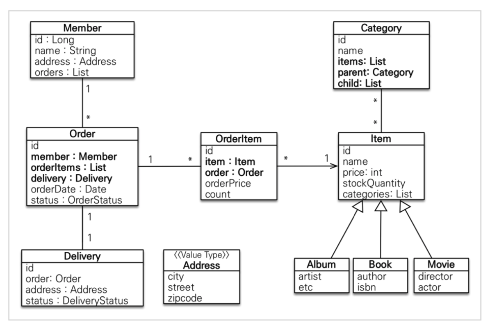

# :book: 실전! 스프링 부트와 JPA 활용

## :pushpin: 살전! 스프링 부트와 JPA 활용

### 도메인 모델과 테이블 설계


- 회원, 주문, 상품의 관계: 회원은 여러 상품을 주문할 수 있다.
그리고 한번 주문할 때 여러 상품을 선택할 수 있으므로 주문과 상품은 다대다 관계다.
하지만 이런 다대다 관계는 관계형 데이터베이스는 물론이고 엔티티에서도 거의 사용하지 않는다.
따라서 그림처럼 주문상품이라는 엔티티를 추가해서 다대다 관계를 일대다, 다대일 관계로 풀어냈다.
- 상품 분류: 상품은 도서, 음반, 영화로 구분되는데 상품이라는 공통 속성을 사용하므로 상속 구조로 표현했다.

### 회원 엔티티 분석



- 회원(Member): 이름과 임베디드 타입인 주소(Address), 그리고 주문(orders) 리스트를 가진다.

- 주문(Order): 한 번 주문시 여러 상품을 주문할 수 있으므로 주문과  주문상품(OrderItem)은 일대다 관계다.
주문은 상품을 주문한 회원과 배송 정보, 주문 날짜, 주문 상태(status)를 가지고 있다. 주문 상태는 열거형을
사용했는데 주문(ORDER), 취소(CANCEL)을 표현할 수 있다.

- 주문상품(OrderItem): 주문한 상품 정보와 주문 금액(orderPrice), 주문 수량(count) 정보를 가지고 있다.
  (보통 OrderLine, LineItem으로 많이 표현한다)

- 상품(Item): 이름, 가격, 재고수량(stockQuantity)을 가지고 있다. 상품을 주문하면 재고 수량이 줄어든다.
상품의 종류로는 도서. 음반, 영화가 있는데 각각은 사용하는 속성이 조금씩 다르다.

- 배송(Delivery: 주문시 하나의 배송 정보를 생성한다. 주문과 배송은 일대일 관계다.

- 카테고리(Category): 상품과 다대다 관계를 맺는다. parent, child로 부모, 자식 카테고리를 연결한다.

- 주소(Address): 값 타입(임베디드 타입)이다. 회원과 배송(Delivery)에서 사용한다.

### 회원 테이블 분석


- 관계형 데이터베이스에서는 다대다 관계 매핑이 안되기 때문에 중간에 CATEGORY_ITEM이라는 매핑 테이블을 두고 다대다 관계를 
일대다, 다대일 관계로 풀어냄


### 연관관계 매핑 분석
- 회원과 주문: 일대다, 다대일의 양방향 관계다. 따라서 연관관계의 주인을 정해야하는데, 외래 키가 있는 주문을 연관관계의 주인으로 정하는 것이 좋다.
그러므로 Order.member를 ORDERS.MEMBER_ID 외래키와 매핑한다.

> **참고: 외래키가 있는 곳을 연관관계의 주인으로 정해라**
> 연관관계의 주인은 단순히 외래 키를 누가 관리하냐의 문제이지 비즈니스상 우위에 있다고 주인으로 정하면 안된다.
> 예를 들어서 자동차와 바퀴가 있으면, 일대다 관계에서 항상 다쪽에 외래 키가 있으므로 외래 키가 있는 바퀴를 
연관관계의 주인으로 정하면 된다. 물론 자동차를 연관관계의 주인으로 정하는 것이 불가능한 것은 아니지만, 자동차를
> 연관관계의 주인으로 정하면 자동차가 관리하지 않는 바퀴 테이블의 외래 키 값이 업데이트되므로 관리와 
> 유지보수가 어렵고 추가적으로 별도의 업데이트 쿼리가 발생하는 성능 문제도 있다.


### 엔티티 클래스 개발
- 실무에서는 가급적 `Getter`는 열어두고, `Setter`는 꼭 필요한 경우에만 사용하는 것을 추천

> 이론적으로 Getter, Setter 모두 제공하지 않고 꼭 필요한 별도의 메서드를 제공하는게 가장 이상적이다.
> 하지만 실무에서 엔티티의 데이터는 조회할 일이 너무 많으므로, Getter의 경우 모두 열어두는 것이 편리하다.
> Getter는 아무리 호출해도 호출하는 것만으로 어떤 일이 발행하지 않는다.
> 하지만 Setter는 문제가 다르다. Setter를 호출하면 데이터가 변한다. 
> Setter를 막 열어두면 가까운 미래에 엔티티가 도대체 왜 변경되는지 추적하기 점점 힘들어진다. 
> 그래서 엔티티를 변경할 때는 Setter 대신에 변경 지점이 명확하도록 변경을 위한 비즈니스 메서드를 별도로 제공해야 한다.


#### 참고: 실무에서는 @ManyToMany를 사용하지 말자
- @ManyToMany는 편리한 것 같지만 중간 테이블(CATEGORY_ITEM)에 컬럼을 추가할 수 없고 세밀하게 쿼리를 실행하기 어렵기 때문에 실무에서 사용하기에는 한계가 있다.
- 중간 엔티티(CategoryItem)를 만들고 @ManyToOne, @OneToMany로 매핑해서 사용하자.
- 정리하면 다대다 매핑을 일대다, 다대일 매핑으로 풀어내서 사용하자.

### 주소 값 타입
```java
package jpabook.jpashop.domain;
import lombok.Getter;
import lombok.Setter;
import javax.persistence.Embeddable;

@Embeddable
@Getter
public class Address {
  private String city;
  private String street;
  private String zipcode;
  protected Address() {
  }
  public Address(String city, String street, String zipcode) {
    this.city = city;
    this.street = street;
    this.zipcode = zipcode;
  } 
}

```
#### 참고: 값 타입은 변경 불가능하게 설계해야 한다.
- @Setter를 제거하고 생성자에서 값을 모두 초기화해서 변경 불가능한 클래스를 만들자.
- JPA 스펙상 엔티티나 임베디트 타입(@Embeddable)은 자바 기본 생성자를 public 또는 protected로 설정해야 한다.
- JPA가 이런 제약을 두는 이유는 JPA 구현 라이브러리가 객체를 생성할 때 리플렉션 같은 기술을 사용할 수 있도록 
지원해야 하기 때문이다.


### 엔티티 설계시 주의점
### 1. 엔티티에는 가급적 Setter를 사용하지 말자.
   - Setter가 모두 열려있다. 변경포인트가 너무 많아서 유지보수가 어렵다. 
### 2. 모든 연관관계는 지연로딩으로 설정
   - 즉시로딩(`EAGER`)은 예측이 어렵고 어떤 SQL이 실행될지 추적하기 어렵다.특히 `JPQL`을 실행할 때 `N+1` 문제가 자주 발생한다.
   - 실무에서 모든 연관관계는 지연로딩(`LAZY`)로 설정해야 한다. 
   - 연관된 엔티티를 함께 DB에서 조회해야 하면, `fetch join` 또는 `엔티티 그래프` 기능을 사용한다.
   - `@XToOne`(OneToOne, ManyToOne) 관계는 기본이 즉시로딩이므로 직접 지연 로딩으로 설정해야 한다.
### 3. 컬렉션은 필드에서 초기화 하자
   - 컬렉션은 필드에서 바로 초기화하는 것이 안전하다.
   - `null` 문제에서 안전하다.
   - 하이버네이트는 엔티티를 영속솨할 때, 컬렉션을 감싸서 하이버네이트가 제공하는 내장 컬렉션으로 변경한다. 만약 getOrders() 처럼 임의의 메서드에서 컬렉션을 잘못 생성하면 하이버네이트 내부 메커니즘에 문제가 발생할 수 있다. 따라서 필드 레벨에서 생성하는 것이 가장 안전하고, 코드도 간결하다.

### 테이블, 컬럼명 생성 전략
- 스프링 부트에서 하이버네이트 기본 매핑 전략을 변경해서 실제 테이블 필드명은 다름
- 하이버네이트 기존 구현: 엔티티의 필드명을 그대로 테이블 명으로 사용 (SpringPhysicalNamingStrategy)
- 스프링 부트 신규 설정 (엔티티(필드) -> 테이블(컬럼))
  - 카멜 케이스 -> 언더스코어 (memberPoint -> member_point)
  - .(점) -> _(언더스코어)
  - 대문자 -> 소문자

### HELLO SHOP 구현 요구사항
- 회원 기능
  - 회원 등록
  - 회원 조회
- 상품 조회
  - 상품 등록
  - 상품 수정
  - 상품 조회
- 주문 기능
  - 상품 주문
  - 주문 내역 조회
  - 주문 취소

### 애플리케이션 아키텍쳐


**계층형 구조 사용**
- `controller`, `web`: 웹 계층
- `service`: 비즈니스 로직, 트랜잭션 처리
- `repository`: JPA를 직접 사용하는 계층, 엔티티 매니저 사용
- `domain`: 엔티티가 모여 있는 계층, 모든 계층에서 사용

**패키지 구조**
- jpabook.jpaashop
  - domain
  - exception
  - repository
  - service
  - web
- 개발 순서: 서비스, 리포지토리 계층을 개발하고, 테스트 케이스를 작성해서 검증, 마지막에 웹 계층 적용
