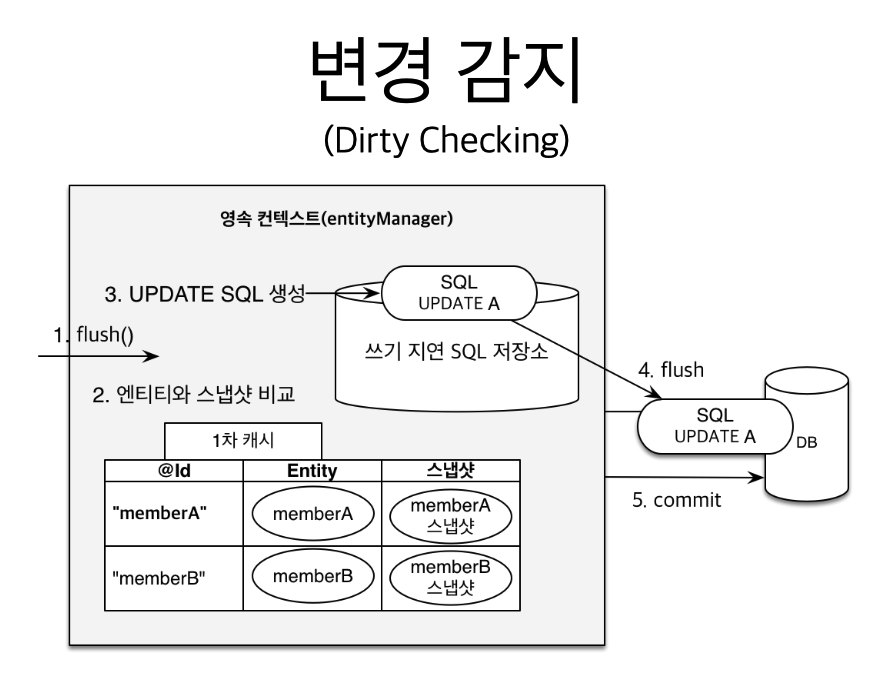

## 2023.03

### :pushpin: 백엔드 주요 면접 질문 정리
1. JAVA의 특징은 무엇인가요?
   - JVM을 이용하기 때문에 운영체제에 독립적
   - 객체지향언어이기 때문에 캡슐화, 상속, 다형성, 추상화의 특징
   - GC를 지원
   
2. 인터페이스와 추상 클래스의 차이
    - 추상 클래스는 abstract로 선언되거나 추상메서드를 하나 이상 포함한 클래스
      - 클래스이기 때문에 하나만 상속이 가능
      - 추상 클래스 -> extends 키워드 사용 하나만 가능
      - 추상 메서드란 선언부만 있고 구현부가 없는 메서드이며 하위 클래스에게 메서드의 구현을 강제
      - 인터페이스는 상속받는 자식 클래스에 모든 메서드에 대한 구현을 강제하며 다중 상속이 가능
      - 인터페이스 -> implements 키워드 사용, 여러개 가능
      
3. Generic이란
   - 제네릭이란 데이터 타입(자료형)을 일반화하는 것으로 데이터 타입을 컴파일 시 미리 지정해주는 것을 말함
   - 보통 클래스나 리스트 타입을 미리 지정할 때 사용

4. JPA 변경 감지 (Dirty Checking)
```
EntityManager em = emf.createEntityManager();
EntityTransaction transaction = em.getTransaction();
transaction.begin();    // 트랜잭션 시작

// 영속 엔티티 조회
Member memberA = em.find(Member.class, "yunyoung1819");

// 영속 엔티티 데이터 수정
memberA.setUsername("yunyoung2020");
memberA.setAge(36);

// em.update(member) 이런 코드가 있어야하지 않을까?

transaction.commit();   // 트랜잭션 커밋
```



1. flush()
2. 엔티티와 스냅샷 비교
3. UPDATE SQL 생성
4. flush
5. commit

