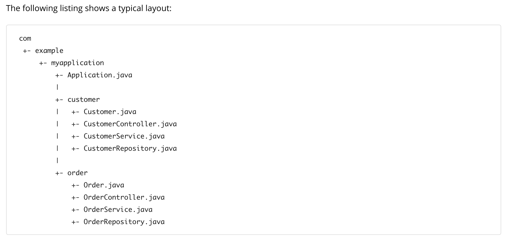
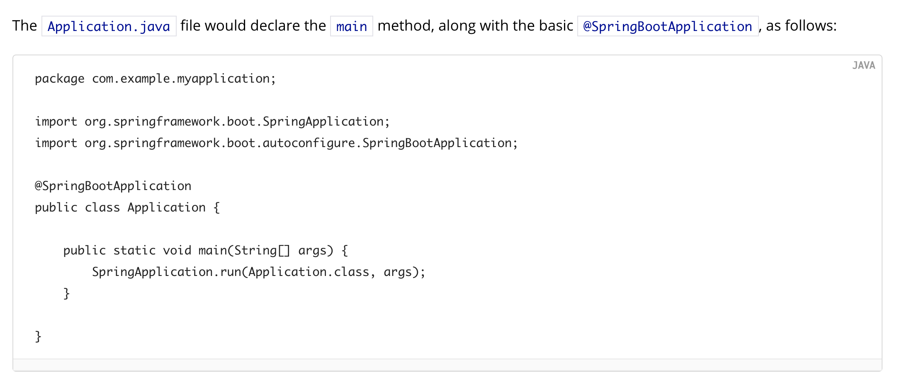

## :book: 백기선의 스프링부트

### 스프링부트

- 스프링 부트(https://spring.io/projects/spring-boot) 프로젝트는 스프링 프레임워크를 
더 빠르고 쉽게 사용할 수 있게 도와주는 툴입니다.
- 제품 수준의 스프링 기반 애플리케이션을 만들때 빠르고 쉽게 만들 수 있도록 도와준다.

### System Requirements

- Spring Boot 2.0.3 RELEASE requires Java 8 or 9 and Spring Framework 5.0.7.RELEASE or above.
Explicit build support is provided for Maven 3.2+ and Gradle 4.

### 스프링부트 프로젝트 구조

- 메이븐 기본 프로젝트 구조와 동일
  - 소스 코드 (src\main\java)
  - 소스 리소스 (src\main\resource)
  - 테스트 코드 (src\test\java)
  - 테스트 리소스 (src\test\resource)

- 메인 애플리케이션 위치
  - 기본 패키지 (이유는 componentScan 때문)

### 의존성 관리 이해

- https://docs.spring.io/spring-boot/docs/current/reference/htmlsingle/#using-boot-dependency-management

### 의존성 관리 응용

- 버전 관리 해주는 의존성 추가
- 인텔리제이에서 라인 넘버에 아래 그림처럼 표시가 뜨는 것은 자동으로 버전 관리를 해주는 의존

- 버전 관리 안해주는 의존성 추가
- 버전을 명시해주기

- 기존 의존성 버전 변경하기
- https://mvnrepository.com/

### 자동 설정 개요

- @EnableAutoConfiguration (@SpringBootApplication 안에 숨어 있음)
- 빈은 사실 두 단계로 나눠서 읽힘
  - 1단계: @ComponentScan
  - 2단계: @EnableAutoConfiguration
  
- @ComponentScan
  - @Component
  - @Configuration @Repository @Service @Controller @RestController
  - @Component 애노테이션이 붙은 클래스를 스캔해서 빈으로 등록해주는 애노테이션
  
- @EnableAutoConfiguration
  - spring.factories
    - org.springframework.boot.autoconfigure.EnableAutoConfiguration
    - @Configuration
    - @ConditionalOnXxxYyyZzz
  
- @Configuration : 빈을 등록하는 설정 파일
  
### @SpringBootApplication은 아래 3가지 애노테이션이 합쳐진 것과 같음 
- @SpringBootConfiguration (@Configuration)과 비슷
- @ComponentScan
- @EnableAutoConfiguration
