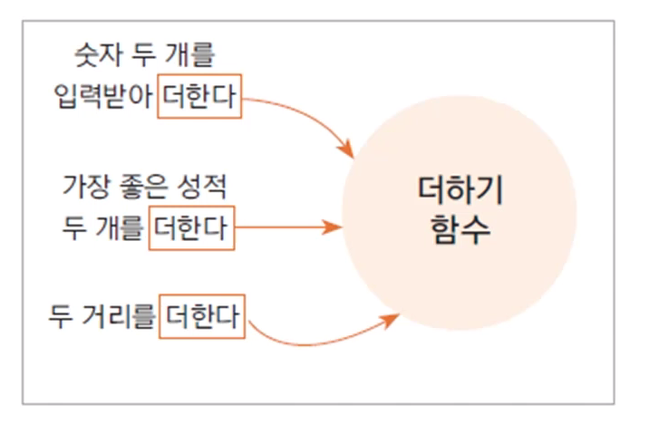
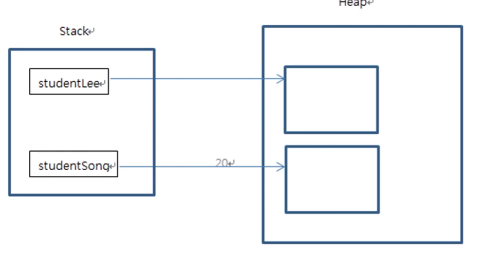
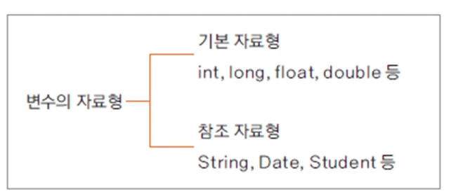
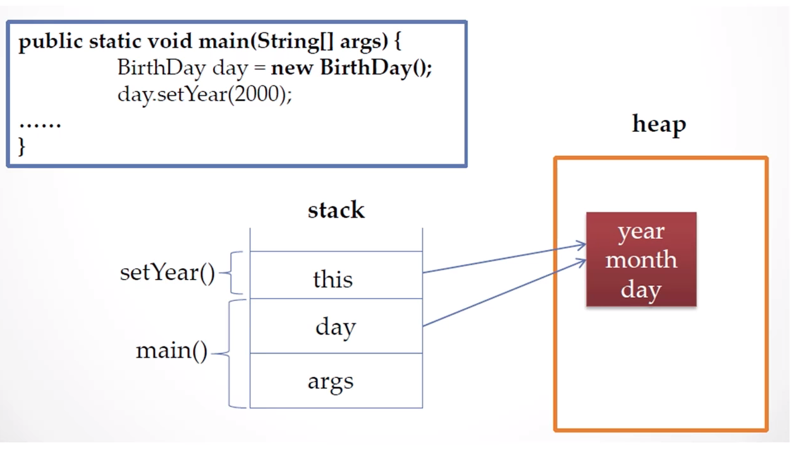
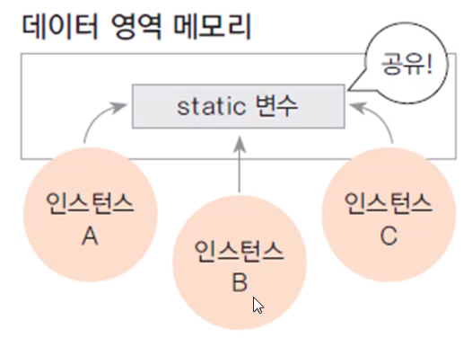
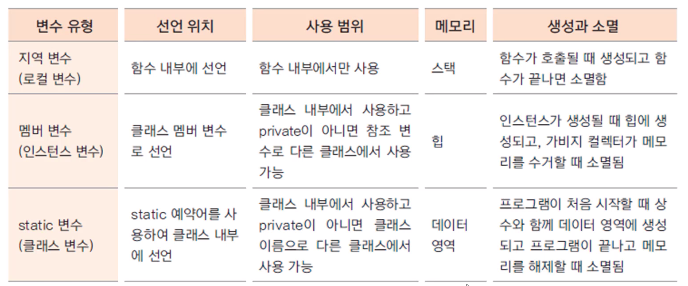

# :book: 객체지향 프로그래밍 기초

## :pushpin: 객체지향 프로그래밍과 클래스 

## :seedling: 객체란 무엇인가요?

### 객체 (Object)

- 의사나 행위가 미치는 대상 (사전적 의미)
- 구체적, 추상적 데이터의 단위
    - 예: 사람, 자동차, 주문, 생산, 관리


### 객제 지향 프로그래밍(Object Oriented Programming: OOP)

- 객체를 기반으로 하는 프로그래밍
- 객체를 정의하고, 객체의 기능을 구현하며, 객체간의 협력(cooperation)을 구현

cf. 절차 지형 프로그래밍 (Procedural Programming)

- 시간이나 사건의 흐름에 따른 구현
- C 언어 


### 학교가는 과정을 구현한 절차 지향 프로그래밍

- 절차 지향 프로그래밍 

> 일어난다 -> 씻는다 -> 밥을 먹는다 -> 버스를 탄다 -> 요금을 지불한다 -> 학교에 도착

- 객체지향 프로그래밍 


## :seedling: 클래스(class)

- 객체를 코드를 구현한 것
- 객체 지향 프로그래밍의 가장 기본 요소
- 객체의 청사진(blueprint)


### 멤버변수, 메서드

> 멤버변수

- 객체가 가지는 속성을 변수로 표현
- 클래스의 멤버변수
- member variable, property, attribute,

> 메서드

- 객체의 기능을 구현
- method, member function


### 클래스 생성하기

- new 키워드를 사용하여 생성자로 생성

> Student studentLee = new Student();


### 클래스의 속성, 메서드 참조하기

- 생성에 사용한 변수(참조변수)로 클래스의 속성, 메서드 참조

- studentLee.studentName = "Lee";
- studentLee.showStudentInfo();


### public 클래스

- 자바 파일 하나에 여러 개의 클래스가 존재할 수도 있음
- 단, public 클래스는 하나이고, public 클래스와 자바 파일 이름은 동일해야함 


## :seedling: 함수와 메서드

### 함수(function) 

- 하나의 기능을 수행하는 일련의 코드
- 함수는 호출하여 사용하고 기능이 수행된 후 값을 반환할 수 있음
- 함수로 구현된 기능은 여러 곳에서 호출되어 사용될 수 있음 




### 함수의 입력과 반환


### 함수 정의하기

- 함수는 이름, 매개변수, 반환 값, 함수 몸체(body)로 구성됨

```
int add(int num1, int num2) 
{
    int result;
    result = num1 + num2;
    return result;    
} 

```


### 메서드 (method)

- 객체의 기능을 구현하기 위해 클래스 내부에 구현되는 함수
- 메서드를 구현함으로써 객체의 기능이 구현됨
- 메서드의 이름은 사용하는 쪽(클라이언트 코드)에 맞게 명명하는 것이 좋음
    - ex) getStudentName()  (camel notation)


### 인스턴스

- 클래스로부터 생성된 객체 
- 힙 메모리에 멤버 변수의 크기에 따라 메모리가 생성
- 클래스를 기반으로 new 키워드를 이용하여 여러 개의 인스턴스를 생성




### 참조 변수와 참조값

> Student studentLee = new Student();

> System.out.println(studentLee);   // 참조변수를 출력


### 용어 정리


| 용어 | 설명 |
| --- | ----|
| 객체 | 객체 지향 프로그램의 대상, 생성된 인스턴스 |
| 클래스 | 객체를 프로그래밍하기 위해 코드로 만든 상태 |
| 인스턴스 | 클래스가 메모리에 생성된 상태 |
| 멤버 변수 | 클래스의 속성, 특성 |
| 메서드 | 멤버 변수를 이용하여 클래스의 기능을 구현 |
| 참조 변수 | 메모리에 생성된 인스턴스를 가리키는 변수 |
| 참조 값 | 생성된 인스턴스의 메모리 주소 값 |


### 생성자 (constructor)

- 객체를 생성할 때 new 키워드와 함께 호출 (객체 생성 외에는 호출할 수 없음)
- 인스턴스를 초기화 하는 코드가 주로 구현됨 (주로 멤버변수 초기화)
- 반환 값이 없음, 상속되지 않음
- 생성자는 클래스 이름과 동일 


### 기본 생성자 (default constructor)

- 하나의 클래스에는 반드시 하나 이상의 생성자가 존재해야함
- 프로그래머가 생성자를 구현하지 않으면 컴파일러가 생성자 코드를 넣어줌

> 기본 생성자

- 기본 생성자는 매개 변수가 없고, 구현부가 없음
- 만약 클래스에 다른 생성자가 있는 경우 디폴트 생성자는 제공되지 않음 


### 생성자 오버로딩 (constructor overloading)

- 생성자를 두 개 이상 구현하는 경우
- 사용하는 코드에서 여러 생성자 중 선택하여 사용할 수 있음
- private 변수도 생성자를 이용하여 초기화를 할 수 있음 


### 참조 자료형 (reference data type)

- 변수의 자료형



- 클래스형으로 변수를 선언함

```
String name;
```

- 기본 자료형은 사용하는 메모리가 정해져 있지만, 참조 자료형은 클래스에 따라 다름 


### 참조 자료형 직접 만들어 사용하기

> 학생 클래스(Student)에 있는 과목 이름, 과목 성적 속성을 과목 클래스(Subject)로 분리하고
Subject 참조 자료형 멤버 변수를 Student에 정의하여 사용함 


## :pushpin: 정보 은닉

### 접근 제어자(access modifier)
˚
- 변수, 메서드, 생성자에 대한 접근 권한 지정
- public, private, protected, 아무 것도 안쓰는 경우 (기본 접근 제어자)
- private을 사용하면 클래스 외부에서는 접근할 수 없음


### 정보 은닉 (information hiding)

- 외부에서 클래스 내부의 정보에 접근하지 못하도록 함
- private 키워드를 활용
- private 변수를 외부에서 접근하게 하려면 public 메서드 제공함
- 클래스 내부 데이터를 잘못 사용하는 오류를 방지할 수 있음 


### this의 역할

- 자신의 메모리를 가리킴
- 생성자에서 다른 생성자를 호출함
- 인스턴스 자신의 주소를 반환


### 자기 자신의 메모리를 가리키는 this




### 생성자에서 다른 생성자를 호출

````
public Person() {
    this("이름없음",1);
}

public Person(String name, int age) {
    this.name = name;
    this.age = age;
}
````


### 객체 간 협력

- 객체 지향 프로그램은 객체를 정의하고 객체간의 협력을 구현한 프로그램
- 학생이 지하철이나 버스를 타고 학교 가는 과정에서 일어나는 협력


> Student 클래스 

```
public class Student {

    String studentName;
    int grade;
    int money;
    
    public Student(String studentName, int money) {
    	this.studentName = studentName;
    	this.money = money;
    }
    
    public void takeBus(Bus bus) {
    	bus.take(1000);
    	this.money -= 1000;
    }
    
    public void takeSubway(Subway subway) {
    	subway.take(1200);
    	this.money -= 1200;
    }
    
    public void takeTaxi(Taxi taxi) {
    	taxi.take(10000);
    	this.money -= 10000;
    }
    
    public void showInfo() {
    	System.out.println(studentName + "님의 남은 돈은 " + money + "원 입니다");
    }
    
}

```

> Bus 클래스 

````
public class Bus {
	
	int busNumber;
	int passengerCount;
	int money;
	
	public Bus(int busNumber) {
		this.busNumber = busNumber;
	}
	
	public void take(int money) {	// 승차
		this.money += money;
		passengerCount++;
	}
	
	public void showBusInfo() {
		System.out.println(busNumber + "번 버스의 승객은 " + passengerCount + "명 이고, 수입은 " + money + "입니다.");
	}
}

````

> Subway 클래스 

```
public class Subway {
	
	int lineNumber;
	int passengerCount;
	int money;
	
	public Subway(int lineNumber) {
		this.lineNumber = lineNumber;
	}
	
	public void take(int money) {
		this.money += money;
		passengerCount++;
	}
	
	public void showSubwayInfo() {
		System.out.println(lineNumber + "번 지하철의 승객은 " + passengerCount + "명 이고, 수입은 " + money + "입니다.");
	}
	
}
```

> Taxi 클래스

````
public class Taxi {
	
	int taxiNumber;
	int passengerCount;
	int money;
	
	public Taxi(int taxiNumber) {
		this.taxiNumber = taxiNumber;
	}
	
	public void take(int money) {
		this.money += money;
		passengerCount++;
	}
	
	public void showTaxiInfo() {
		System.out.println(taxiNumber + "번 택시의 승객은 " + passengerCount + "명 이고, 수입은 " + money + "입니다.");
	}

}
````

> TakeTransTest

```
public class TakeTransTest {
	
	public static void main(String[] args) {
		Student studentJ = new Student("James", 5000);
		Student studentT = new Student("Tomas", 10000);
		Student studentE = new Student("Edward", 12000);
		
		Bus bus100 = new Bus(100);
		Bus bus500 = new Bus(500);
		
		Subway subwayGreen = new Subway(2);
		Subway subwayBlue = new Subway(4);
		
		Taxi taxi2049 = new Taxi(2049);
		
		studentJ.takeBus(bus100);
		studentT.takeSubway(subwayGreen);
		studentE.takeTaxi(taxi2049);
		
		studentJ.showInfo();
		studentT.showInfo();
		studentE.showInfo();
		
		bus100.showBusInfo();
		bus500.showBusInfo();
		
		subwayGreen.showSubwayInfo();
		
		taxi2049.showTaxiInfo();
	}

}
```


### static 변수

- 여러 인스턴스가 하나의 값을 공유할 필요가 있음 



- static 변수는 처음 프로그램이 로드될 때 데이터 영역에 생성됨
- 인스턴스의 생성과 상관 없이 사용할 수 있으므로 클래스 이름으로 참조

```
Student.serialNum = 100;
```

- 클래스 변수, 정적 변수라고도 함 


### static 변수와 인스턴스 변수


- 데이터 영역에 위치한 동일한 메모리를 참조


### static 메서드

- static 변수를 위한 기능을 제공하는 static 메서드
- static 메서드에서는 인스턴스 변수를 사용할 수 없음
- 클래스 이름으로 참조하여 사용하는 메서드

``
Student.getSerialNUm();
``

- 클래스 메서드, 정적 메서드라고도 함 


### 프로그램에서 변수의 유형




### 단 하나만 존재하는 인스턴스 - singleton pattern

- 생성자는 private으로
- static으로 유일한 객체 생성
- 외부에서 유일한 객체를 참조할 수 있는 public static get() 메서드 구현


### 배열이란?

- 동일한 자료형의 순차적 자료 구조
- 배열 선언하기 

```
int[] arr = new int[10];
int arr[] = new int[10];
```

- 메모리 구조 


