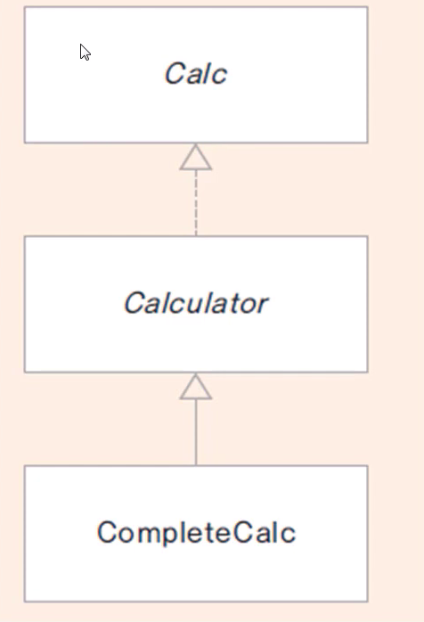

# :book: 객체지향 프로그래밍 

## :pushpin: 객체지향 프로그래밍 중급

## :seedling: 인터페이스

### 인터페이스의 요소

> 인터페이스: 어떤 객체(오브젝트)에 대한 명세, 일종의 설명서

- 추상 메서드
- 상수
- 디폴트 메서드
- 정적 메서드
- private 메서드


### 인터페이스 선언과 구현

````
public interface Calc {
    double PI = 3.14;       // 인터페이스에서 선언한 변수는 컴파일 과정에서 상수로 변환됨 
    int ERROR = -999999999;
    
    int add(int num1, int num2);    // 인터페이스에서 선언한 메서드는 컴파일 과정에서 추상 메서드로 변환됨 $
    int substract(int num1, int num2);
    int times(int num1, int num2); 
    int divide(int num1, int num2);
}
````




### 타입 상속과 형 변환

> Calc calc = new CompleteCalc();

- 인터페이스를 구현한 클래스는 인터페이스 타입으로 변수를 선언하여 인스턴스를 생성할 수 있음
- 인터페이스는 구현 코드가 없기 때문에 타입 상속이라고도 함

