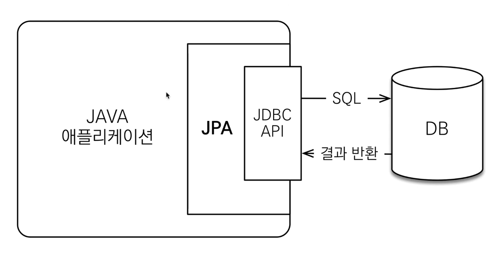

## JPA 소개


### JPA?
- Java Persistence API
- 자바 진영의 ORM 기술 표준


### ORM?
- Object-relational mapping(객체 관계 매핑)
- 객체는 객체대로 설계
- 관계형 데이터베이스는 관계형 데이터베이스대로 설계
- ORM 프레임워크가 중간에서 매핑
- 대중적인 언어에는 대부분 ORM 기술이 존재


### JPA는 애플리케이션과 JDBC 사이에서 동작




### JPA 소개

- EJB 엔티티 빈(자바 표준)
- 하이버네이트 (오픈 소스)
- JPA (자바 표준)


### JPA는 표준 명세
- JPA는 인터페이스의 모음
- JPA 2.1 표준 명세를 구현한 3가지 구현체
- 하이버네이트, EclipseLink, DataNucleus


### JPA 버전
- JPA 1.0 (JSR 200) 2006년 : 초기 버전. 복합 키와 연관관계 기능이 부족
- JPA 2.0 (JSR 317) 2009년 : 대부분의 ORM 기능을 포함, JPA Criteria 추가
- JPA 2.1 (JSR 338) 2013년 : 스토어드 프로시저 접근, 컨버터(Converter), 엔티티 그래프 기능이 추가


### JPA를 왜 사용해야 하는가?

- SQL 중심적인 개발에서 객체 중심으로 개발
- 생산성
_ 유지보수
- 패러다임의 불일치 해결
- 성능
- 데이터 접근 추상화와 벤더 독립성
- 표준


### 생산성

- JPA와 CRUD
- 저장: jpa.persist(member)
- 조회: Member member = jpa.find(memberId)
- 수정: member.setName("변경할 이름")
- 삭제: jpa.remove(member)


### 유지보수

- 기존: 필드 변경시 모든 SQL 수정
```
public class Member {
    private String memberId;
    private String name;
    private String tel;
    ...
}
```

```
INSERT INTO MEMBER(MEMBER_ID, NAME, TEL) VALUES
SELECT MEMBER_ID, NAME, TEL FROM MEMBER M
UPDATE MEMBER SET .. TEL = ?
```


### JPA와 패러다임의 불일치 해결

1. JPA와 상속
2. JPA와 연관관계
3. JPA와 객체 그래프 탐색
4. JPA와 비교하기


### JPA의 성능 최적화 기능

1. 1차 캐시와 동일성(identity) 보장
2. 트랜잭션을 지원하는 쓰기 지연(transactional write-behind)
3. 지연 로딩(Lazy Loading)


### 지연 로딩과 즉시 로딩

- 지연 로딩: 객체가 실제 사용될 때 로딩
- 즉시 로딩: JOIN SQL로 한번에 연관된 객체까지 미리 조회

> 지연 로딩
```
Member member = memberDAO.find(memberId);       => SELECT * FROM MEMBER
Team team = member.getTeam();
String teamName = team.getName();               => SELECT * FROM TEAM
```

> 즉시 로딩
```
Member member = memberDAO.find(memberId);       => SELECT M.*, T.* FROM MEMBER JOIN TEAM ...
Team team = member.getTeam();
String teamName = team.getName();
```


### ORM은 객체와 RDB 두 기둥 위에 있는 기술


