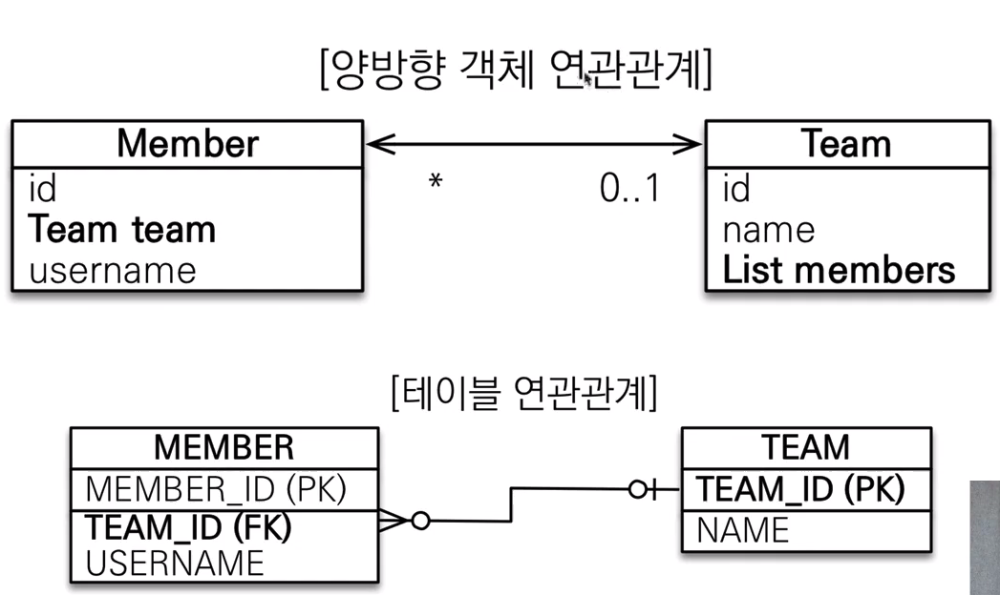
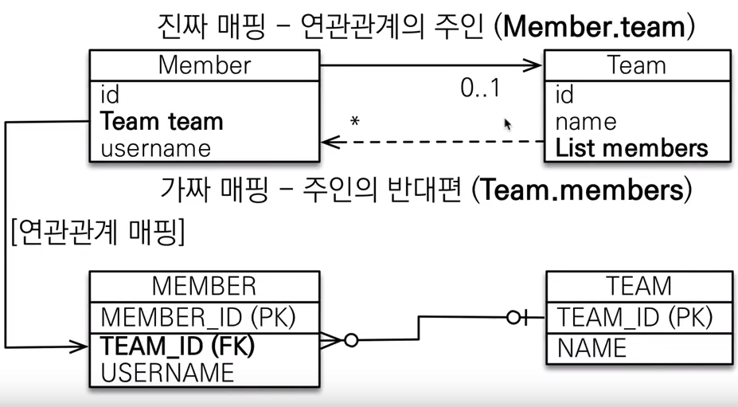

# :book: 자바 ORM 프로그래밍 기본편 

## :pushpin: 양방향 연관관계와 연관관계의 주인 


### 양방향 매핑




> Member 엔티티는 단방향과 동일 

````
@Entity
public class Member {

    @Id @GeneratedValue
    private Long id;
    
    @Column(name = "USERNAME")
    private String name;
    
    private int age;
    
    @ManyToOne
    @JoinColumn(name = "TEAM_ID")
    private Team team;
}

````

> Team 엔티티는 컬렉션 추가

```
@Entity
public class Team {
    
    @Id @GeneratedValue
    private Long id;
    
    private String name;
    
    @OneToMany(mappedBy = "team")
    List<Member> members = new ArrayList<Member>();
}
```

> 양방향 매핑  (반대 방향으로 객체 그래프 탐색)

````
// 조회
Team findTeam = em.find(Team.class, team.getId());

int memberSize = findTeam.getMembers().size(); // 역방향 조회 
````


### 연관관계의 주인과 mappedBy

- mappedBy = JPA의 멘탈 붕괴 난이도
- mappedBy는 처음에는 이해하기 어렵다.
- 객체와 테이블간에 연관관계를 맺는 차이를 이해해야한다.


### 객체와 테이블이 관계를 맺는 차이

- 객체 연관관계 = 2개
    - 회원 -> 팀 연관관계 1개 (단방향)
    - 팀 -> 회원 연관관계 1개 (단방향)
    
- 테이블 연관관계 = 1개
    - 회원 <-> 팀의 연관관계 1개 (양방향)
    

### 객체의 양방향 관계

- 객체의 양방향 관계는 사실 양방향 관계가 아니라 서로 다른 단방향 관계 2개다.
- 객체를 양방향으로 참조하려면 단방향 연관관계를 2개 만들어야 한다.

> A -> B (a.getB())

````
class A {
    B b;
}
````

> B -> A (b.getA())

```
class B {
    A a;
}
```

### 테이블의 양방향 연관관계

- 테이블은 외래 키 하나로 두 테이블의 연관관계를 관리 
- MEMBER.TEAM_ID 외래 키 하나로 양방향 연관관계 가짐 (양쪽으로 조인할 수 있다)


```
SELECT * 
FROM MEMBER M
JOIN TEAM T ON M.TEAM_ID = T.TEAM_ID

SELECT *
FROM TEAM T
JOIN MEMBER M ON T.TEAM_ID = M.TEAM_ID
```


### 둘 중 하나로 외래 키를 관리해야 한다.


### 연관관계의 주인(Owner)

> 양방향 매핑 규칙

- 객체의 두 관계중 하나를 연관관계의 주인으로 지정
- 연관관계의 주인만이 외래 키를 관리 (등록, 수정)
- 주인이 아닌 쪽은 읽기만 가능
- 주인은 mappedBy 속성 사용 X
- 주인이 아니면 mappedBy 속성으로 주인 지정 


### 누구를 주인으로?

- 외래 키가 있는 곳을 주인으로 정해라
- 여기서는 Member.team이 연관관계의 주인




### 양방향 매핑시 가장 많이 하는 실수 

> 연관관계의 주인에 값을 입력하지 않음

````
Team team = new Team();
team.setName("레알 마드리드");
em.persist(team);

Member member = new Member();
member.setName("크리스티아누 호날두");

// 역방향 (주인이 아닌 방향)만 연관관계 설정
team.getMembers().add(member);

em.persist(member);››
````


