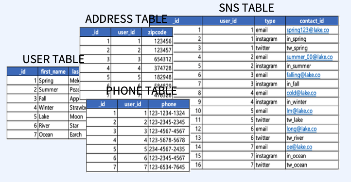
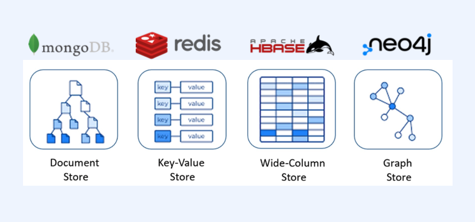
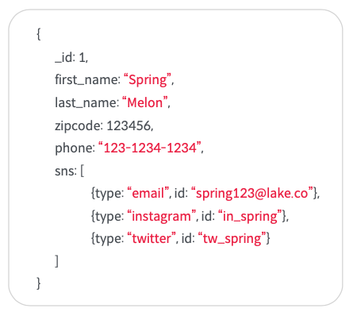

# :book: 백엔드 개발자를 위한 대용량 데이터 & 트래픽 처리
## :pushpin: Chapter 02. 비즈니스 요구사항에 유연한 MongoDB

### What is DBA (Database Adminitrator)
  - 안정적으로 `DB`를 사용할 수 있도록 용량 산정
  - 스키마 구성 및 관리
  - 테스트 및 쿼리 튜닝
  - 백업 및 모니터링
  - 다양한 Database 관련 이슈 처리
  - 개발자 문의 대응
  - New Feature 연구

### Why is MongoDB Popular?
- `Schema`가 자유롭다.
- `HA`와 `Scale-Out` Solution을 자체적으로 지원해서 확장이 쉽다.
- `Secondary Index`를 지원하는 NoSQL 이다.
- 다양한 종류의 `Index`를 제공한다.
- 응답 속도가 빠르다.
- 배우기 쉽고 간편하게 개발이 가능하다.

> MongoDB는 유연하고 확장성 높은 Opensource Document 지향 Database 이다. 

## SQL vs NoSQL
### Structure & Schema

장단점
- **데이터 중복을 방지할 수 있다.**
- **Join의 성능이 좋다.**
- **복잡하고 다양한 쿼리가 가능하다.**
- **잘못된 입력을 방지할 수 있다.**
- 하나의 레코드를 확인하기 위해 여러 테이블을 Join하여 가시성이 떨어진다.
- 스키마가 엄격해서 변경에 대한 공수가 크다.
- Scale-Out이 가능하지만 설정이 어렵다.
- 확장할 때마다 App단의 수정이 필요하다.
- 전통적으로 Scale-Up 위주로 확장했다.

### NoSQL

### MongoDB

장단점
- **데이터 접근성과 가시성이 좋다.**
- **Join없이 조회가 가능해서 응답 속도가 일반적으로 빠르다.**
- **스키마 변경에 공수가 적다.**
- **스키마가 유연해서 데이터 모델을 App의 요구사항에 맞게 데이터를 수용할 수 있다.**
- 데이터의 중복이 발생한다.
- 스키마가 자유롭지만, 스키마 설계를 잘해야 성능 저하를 피할 수 있다.

### Scaling
장단점
- HA와 Sharding에 대한 솔루션을 자체적으로 지원하고 있어 Scale-Out이 간편하다.
- 확장 시, Application의 변경사항이 없다.

### Summary
- MongoDB는 Document 지향 Database이다.
- 데이터 중복이 발생할 수 있지만 접근성과 가시성이 좋다.
- 스키마 설계가 어렵지만, 스키마가 유연해서 Application의 요구사항에 맞게 데이터를 수용할 수 있다.
- 분산에 대한 솔루션을 자체적으로 지원해서 Scale-Out이 쉽다.
- 확장 시 Application을 변경하지 않아도 된다.

> MongoDB는 유연하고 확장성 높은 Opensource Document 지향 Database이다.