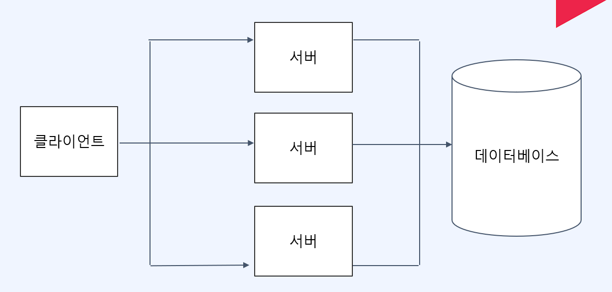
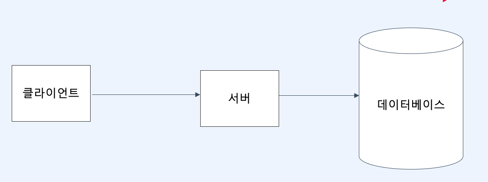
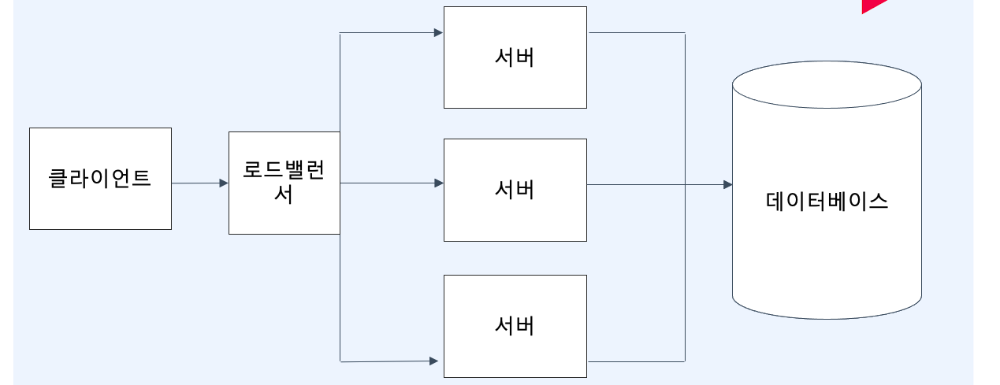
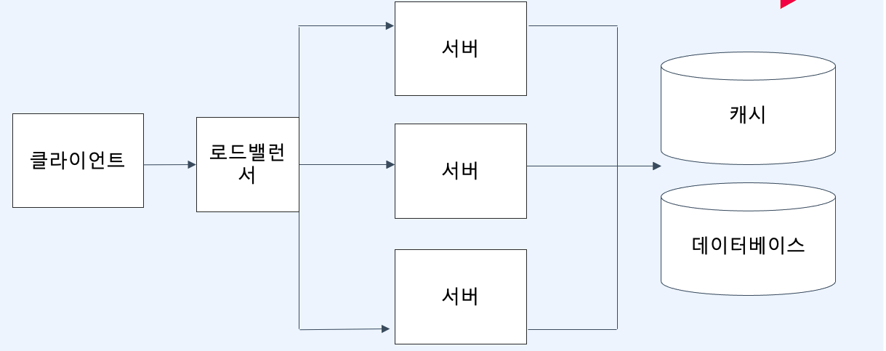
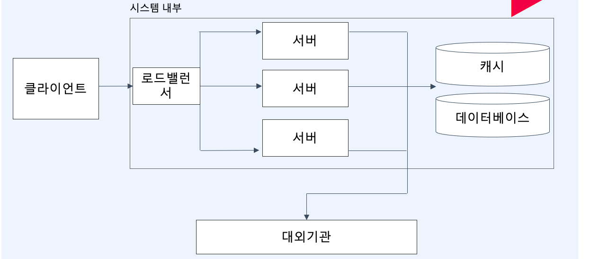
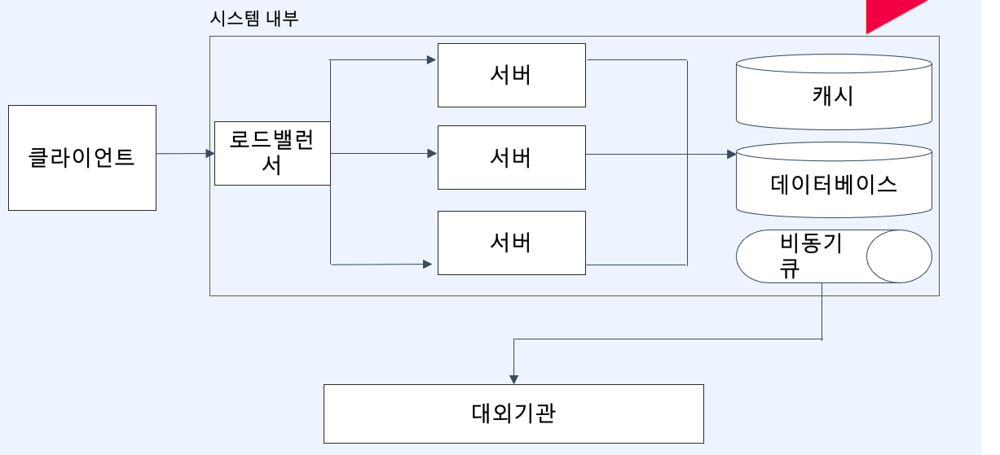

# :book: 패스트캠퍼스 백엔드 개발자를 위한 한 번에 끝내는 대용량 데이터 & 트래픽 처리
## :pushpin: Chapter 02. 대용량 시스템에 대한 이해 
### :seedling: 01. 웹의 기본 아키텍처
- 웹의 기본 아키텍처
  - 클라이언트 
  - 서버
  - 데이터베이스

- 웹의 요구 사항이 점점 복잡해짐
  - 클라이언트
  - 웹 서버
  - 웹 애플리케이션 서버
  - 데이터베이스

#### 웹 서버, 웹 애플리케이션 서버는 왜 나누어져 있을까?
- 태초에는 웹서버만 있는 형태에서 웹의 복잡도가 증가함에 따라...
- 관심사의 분리 / 관측 가능한 시스템 / 효율적인 리소스 사용

#### 대용량 시스템의 모습

### :seedling: 02. 왜 데이터베이스가 병목일까?

- 스케일 업(scale up)과 스케일 아웃(scale out)

|            |스케일 업|스케일 아웃|
|---------------------|----|----|
|유지보수 및 관리|쉬움|여러 노드에 적절히 부하 분산 필요|
|확장성|제약이 있음|스케일 업에 비해 자유로움|
|장애복구|서버가 1대, 다운타임이 있음|장애 탄력성이 있음|

#### 언제 스케일 아웃이 가능한가?
- 같은 입력에 대해서는 항상 같은 결과를 반환

#### 그렇다면 데이터베이스를 스케일 아웃을 하기는 어려울까?

- 데이터베이스는 `데이터`라는 상태를 관리하고 있어 서버보다 스케일 아웃을 하기 위해서는 훨씬 많은 비용이 필요
- 현대 서버 아키텍처는 상태관리를 데이터베이스에 위임하고 서버는 상태관리를 하지 않는 방향으로 발전
- 스케일 아웃 외에도 데이터베이스는 디스크의 데이터를 접근해서 가져온다.

### :seedling: 03. 대용량 시스템 아키텍처 맛보기

#### 대용량 트래픽 / 데이터 처리는 왜 어려울까?
- 하나의 서버 또는 데이터베이스로 감당하기 힘든 `부하`
  - 다수의 서버와 데이터베이스를 마치 하나인 것처럼
- 웹 서비스들은 24시간 `무중단`
  - 잘못된 코드 한줄이 미치는 영향의 범위가 크다
- 여러 `마이크로 서비스`들이 복잡한 의존 관계를 가진다.

#### 대용량 시스템이 어려운 이유
- 하나의 서버로 감당하기 힘들어 대부분 여러개의 서버 또는 데이터베이스를 사용함
- 여러개의 서버에서 유입되는 데이터의 일관성을 보장할 수 있어야함
- 코드 한줄이 데이터에 미치는 영향 범위가 굉장히 커짐
- 여러 서비스들이 얽혀있어 시스템 복잡도가 상당히 높음

#### 그렇다면 대용량 시스템은 어떠해야하는가?
- `고가용성`
  - 언제든 서비스를 이용할 수 있어야한다.
- `확장성`
  - 시스템이 비대해짐에 따라 증가하는 데이터와 트래픽에 대응할 수 있어야한다.
- `관측가능성`
  - 문제가 생겼을 때 빠르게 인지할 수 있어야하고 문제의 범위를 최소화할 수 있어야 한다.

#### 대용량 시스템의 아키텍처는 어떤 모습을 하고 있는지 점진적으로 시스템을 발전시켜보자

#### 시스템 발전시켜보기

