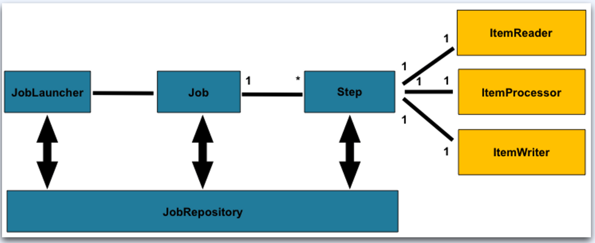
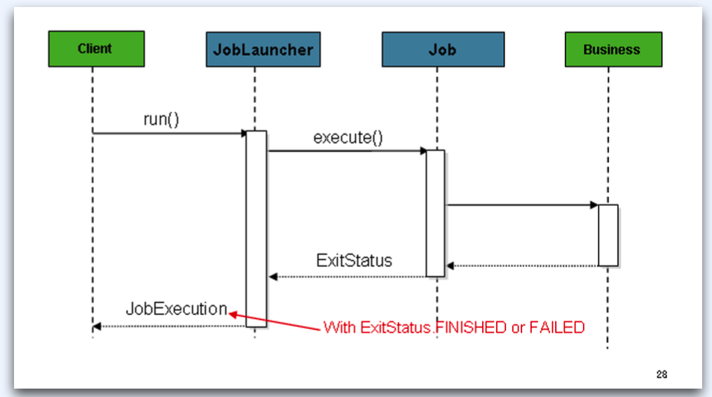
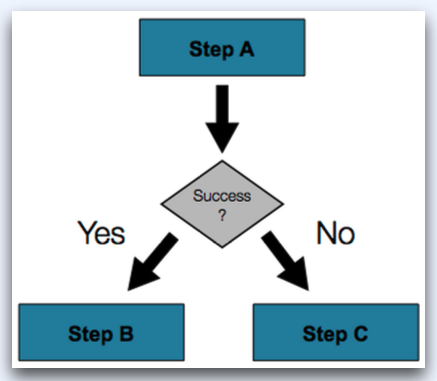
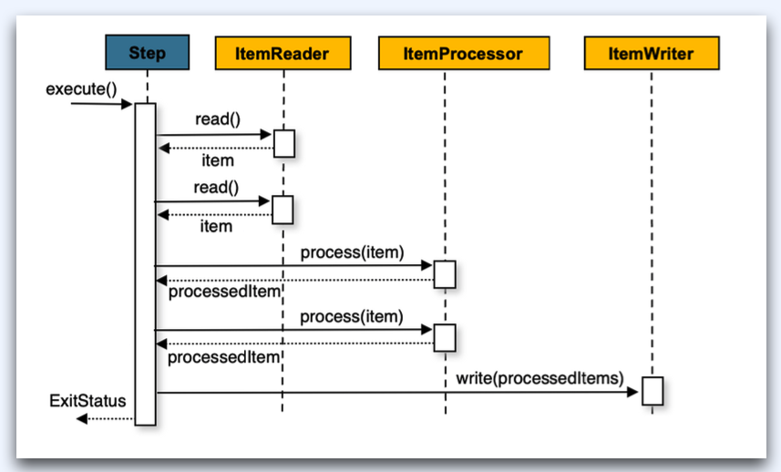

# :book: 백엔드 개발자를 위한 대용량 데이터 & 트래픽 처리
## :pushpin: 스프링 배치 알아보기

### 스프링 배치란?
- 일상적인 배치 처리 + 엔터프라이즈급의 시스템 처리
- 자바의 장점 + 스프링 프레임워크의 장점 = 모두 갖춘 배치 프레임워크
- 배치 처리에 대한 표준 인터페이스(JSR-352) 구현
- 대규모 온라인 커뮤니티
- 이미 실무에서 안정적으로 사용되고 발전해 온 이력

### 스프링 배치의 지원 기능
- 트랜잭션 관리
- 청크 단위의 처리
- 선언적 입출력 지원
- 병렬처리
- 시작, 중지, 재시작 지원
- 재시도 또는 건너뛰기 지원
- 웹 기반 관리 인터페이스 제공 (Spring Cloud Data Flow)

### 스프링 배치의 실무 사용 사례
- 배달 상점의 메뉴 등록 및 수정
- 프랜차이즈의 메뉴 및 가격 업데이트
- 회원 포인트 적립
- 쿠폰 발급
- ETL (추출, 변환, 적재)
- 데이터 마이그레이션
- 검색 인덱싱
- 상품 관리

### 스프링 배치의 기술적 특징
- 개발자는 `스프링 프로그래밍 모델`을 그대로 배치 프로그램 개발에 사용
- 인프라, 배치 실행 환경, 배치 어플리케이션의 `명확한 분리`
- `Jar` 형태의 간단한 배포 모델 제공
- 스케쥴링 하는 기능은 제공하지 않는다.
  - 다양한 `스케쥴링 도구`와 연동 가능
- 모든 프로젝트에서 사용 가능한 `배치 관련 인터페이스 제공`
- 쉬운 구성, 설정, 그리고 사용자 지정과 확장

### 스프링 배치 아키텍쳐
- 3개의 티어로 구성된 아키텍쳐
- 어플리케이션, 코어, 인프라스트럭처
  - `어플리케이션` - 코어와 상호 작용
  - `코어` - 잡, 스텝, 잡 런처, 잡 파라미터 등의 배치 도메인 요소들
  - `인프라스트럭처` - 배치 처리를 위해 필요한 공통 인프라 제공

### 스프링 배치 - 도메인 언어
- 스프링 배치 어플리케이션을 작성하기 위해 필요한 요소
- Job
  - `JobInstance`
  - `JobExecution`
  - `JobParameter`
  - `JobListener`
- Step
  - `Tasklet` 기반
  - `Chunk` 기반 



### Job
- `스프링 빈 구성` - 유일하다
- 외부 의존성 없이 `독립성`을 갖는다.
- 스프링 배치에서 실행되는 `처리 단위`
  - 상호 작용없이 처음부터 끝까지 실행된다.
- 스텝을 담는 `컨테이너` 개념
- 하나 또는 여러 개의 `스텝`으로 구성


### JobInstance
- Job의 `논리적 실행 단위`
- Job이 성공적으로 완료되면 다시 실행시킬 수 없다.
- `Job 이름`과 `Job 파라미터`로 구분된다.
- 동일한 Job 이름에 동일한 파라미터를 사용하여 **단 한번만 실행**

### JobExecution
- Job을 실행한 것을 의미
- 실패든 성공이든 시도한 것을 나타낸다.

### JobParameter
- 잡에 전달되는 파라미터

### JobListener
- **Job 실행과 관련한 이벤트**를 받을 수 있는 기능을 제공

```java
public interface JobExecutionListener {
	
	void beforeJob(JobExecution jobExecution);
	
	void afterJob(JobExecution jobExecution);
}
```

### Step
- `Job을 구성`하고 있는 배치 작업의 `독립적`이고 `순차적`인 `단위`
- 주요 유형
- `Tasklet` 기반 Step
  - 간단한 실행 처리
- `Chunk` 기반 Step
  - 아이템 기반의 처리
  - ItemReader
  - ItemProcessor
  - ItemWriter

### Tasklet
- 간단한 실행 처리
- execute 메서드
- 하나의 트랜잭션 단위로 동작

```java
@FunctionalInterface
public interface Tasklet {
  @Nullable 
  RepeatStatus execute(StepContribution contribution, ChunkContext chunkContext) throws Exception;
}
```

### ItemReader, ItemProcessor, ItemWriter
- ItemReader
  - 스텝에서 한 번에 한 항목씩 입력을 나타내는 추상화 인터페이스
- ItemProcessor
  - 스텝에서 아이템에 대한 비지니스 처리를 나타내는 추상화 인터페이스
- ItemWriter
  - 스텝에서 한 번에 하나의 배치 또는 묶음의 출력을 나타내는 추상화 인터페이스

### 스프링 배치의 잡 처리 흐름


### 스프링 배치의 스텝 처리 흐름
- Step -> ItemReader -> ItemWriter
- Step -> ItemReader -> ItemProcessor -> ItemWriter

### Step의 흐름
- 순서 
- 분기 

#### 순서
- 스텝은 각 스텝과의 순서를 지정 가능

```text
@Bean
public Job job(JobRepository jobRepository) {
    return new JobBuilder("job", jobRepository)
        .start(stepA())
        .next(stepB())
        .next(stepC())
        .build();
}
```

#### 분기
- Step은 스텝의 종료(ExitStatus)를 패턴 매칭하여 다른 스텝으로 분기 가능
- `*` matches zero or more characters -
- `?` matches exactly one character

````
@Bean
public Job job(JobRepository jobRepository) {
  return new JobBuilder("job", jobRepository)
    .start(stepA())
    .on("*").to(StepB())
    .from(stepA()).on("FAILED").to(stepC())
    .end()
    .build();
}
````




### ItemReader
- 아이템 읽기와 관련한 전략 인터페이스
- 다양한 입력소스로부터 읽어들인다.
- `Step`에서 처리할 아이템 한 개를 반환

```text
public interface ItemReader<T> {
    T read() throws Exception, ..., NonTransientResourceException;
}
```



### ItemReader 종류
- FlatFileItemReader (예, csv파일)
- StaxEventItemReader (예, xml 파일)
- JsonItemReader (예, json파일)
- JdbcCursorItemReader (데이터베이스)
- JdbcPagingItemReader (데이터베이스)
- JpaPagingItemReader (데이터베이스)
- HibernateCursorItemReader (데이터베이스)
- StoredProcedureItemReader (데이터베이스)

### ItemProcessor
- 입력 소스에서 읽은 아이템 기반으로 특정 작업을 수행
- 처리를 완료 후 결과 아이템을 반환
- 입력 아이템의 타입과 결과 아이템의 타입이 다를 수 있다.
- 여러번 전달되더라도 동일 결과를 갖는 멱등성을 가져야 한다.

```text
public interface ItemProcessor<I, O> {
    O process(I item) throws Exception;
}
```

### ItemWriter
- 스프링 배치에서 출력을 담당하는 전략 인터페이스
- 아이템을 하나하나 쓰지 않고 묶어서 쓴다.
  - Chunk 단위
  - 아이템 리더와 다름. 혼동할 수 있음

```text
public interface ItemWriter<T> {
    void write(Chunk<? extends T> items) throws Exception;
}
```

### ItemWriter 종류
- FlatFileItemWriter
- StaxEventItemWriter
- JsonFileItemWriter
- JdbcBatchItemWriter
- HibernateItemWriter
- JpaItemWriter

### 실전 Tips!
- API 서버를 배치 용도로 쓰지말자
- 스프링 배치도 분산이 필요하다.
  - 도메인별 배치 시스템
- 서비스 DB 부하 주지 않도록 조심
- 배치 실행 단위는 단계별로 하기
  - 1개
  - 10개
  - 100개

### Spring Batch Meta Tables
- 스프링 배치는 배치 시스템에 필요한 메타 테이블이 필요하다.
- 스프링 배치에서 이 메타 테이블에 연결이 필요하다.


### 특정 Job만 실행시키기
```text
--spring.batch.job.names=[잡이름]
```

### 실행 Jar 만들고 배치 실행
```text
$ ./gradlew :bootJar
$ java -jar build/libs/hello-spring-batch-0.0.1-SNAPSHOT.jar
```