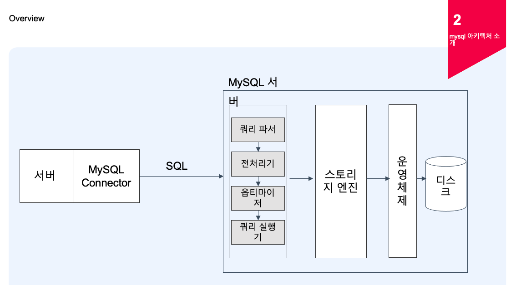
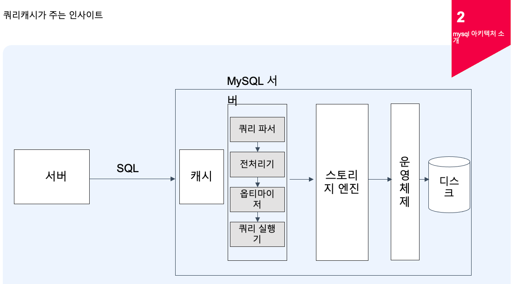
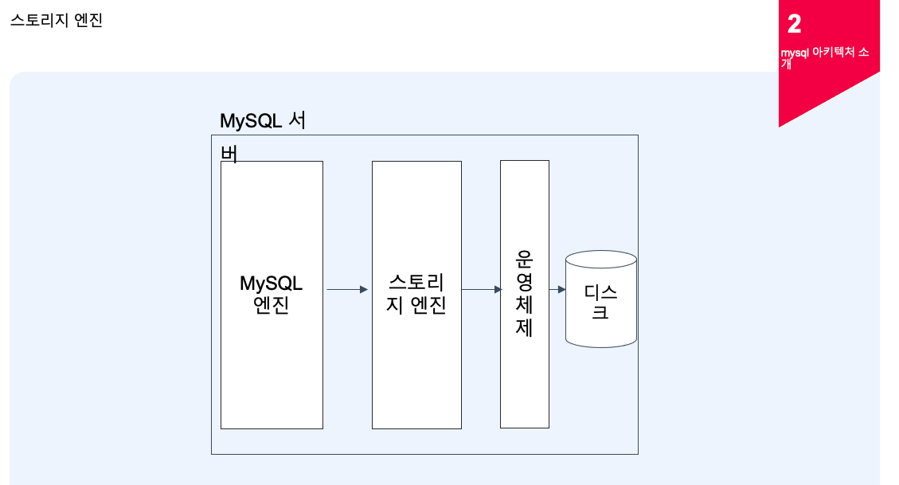

# :book: 백엔드 개발자를 위한 대용량 데이터 & 트래픽 처리

## :pushpin: MySQL 소개
### :seedling: 01. MySQL을 학습하는 이유
- 수많은 종류의 데이터베이스들
    - Document DB
    - 관계형 DB
    - 전문색인 DB
    - Key-value DB
    - Graph DB
    - Wide column DB
    
- 관계형 데이터베이스는 아직까지도 가장 범용적으로 사용
- 백엔드 개발자라면 아주 높은 확률로 관게형 데이터베이스를 실무에서 다루게 될 것

### 관계형 데이터베이스 안에서도 많은 데이터베이스들이 있음
- Oracle
- Postgresql
- MySQL
- MariaDB

### MySQL
- 가장 인기 많은 오픈소스 관계형 데이터베이스
    - http://github.com/mysql/mysql-server
    - https://dev.mysql.com/doc/internals/en/guided-tour.html
    - https://dev.mysql.com/doc/dev/mysql-server/latest/
- 높은 접근성과 낮은 비용
- 네이버, 카카오, 토스 등 대부분의 국내 IT 기업에서 가장 많이 사용됨
- sql 안식 표준을 지키고 있음

### :seedling: 02. MySQL 아키텍처 소개
- 클라이언트 -> 서버 -> 데이터베이스 (3티어 아키텍처)

- `데이터베이스`는 `파일을 관리하는 서버`
- `데이터베이스 관점`에서는 `서버`가 `클라이언트`가 됨
- 3티어 아키텍처에서 클라이언트가 서버에 `Json`으로 요청하는 것과 같이 백엔드 서버는 MySQL 서버에 `SQL`을 통해서 요청을 하게됨

### MySQL 아키텍처

- 서버에서 요청 SQL은 `MySQL 엔진`, `스토리지 엔진`을 거쳐 `운영체제`를 통해 `디스크`에 접근하여 데이터를 서버에 전달함
- `MySQL 엔진`은 사람으로 비유하면 판단과 명령을 내리는 `두뇌`
- `스토리지 엔진`은 동작을 수행하는 `팔과 다리`와 같은 역할

### 쿼리파서, 전처리기

 - `쿼리파서`
   - SQL을 파싱하여 `Syntax Tree`를 만듬
   - 이 과정에서 `문법 오류 검사`가 이루어짐
 - `전처리기` 
   - 쿼리파서에서 만든 Tree를 바탕으로 `전처리` 시작
   - 테이블이나 컬럼 존재 여부, 접근권한 등 `Semantic 오류` 검사
 - 쿼리파서, 전처리기는 컴파일 과정과 매우 유사하다.
 - 하지만 SQL은 프로그래밍 언어처럼 컴파일 타임 때 검증할 수 없어 매번 구문 평가를 진행

### 옵티마이저
- `옵티마이저`
  - 쿼리를 처리하기 위한 여러 방법들을 만들고, 각 방법들의 비용 정보와 테이블의 통계 정보를 이용해 비용을 산정
  - 테이블 순서, 불필요한 조건 제거, 통계 정보를 바탕으로 전략을 결정 (`실행계획` 수립)
  - 옵티마이저가 어떤 전략을 결정하느냐에 따라 성능이 많이 달라진다.
  - 가끔씩 성능이 나쁜 판단을 해 개발자가 `힌트`를 사용해 도움을 줄 수 있다.

### 쿼리실행기
- `쿼리실행기`
  - 옵티마이저 -> 쿼리 실행기 -> 스토리지 엔진

### 쿼리캐시가 주는 인사이트

- MySQL 5.0까지는 쿼리 캐시라는 것이 있었음
- 8.0 대에 들어와서 쿼리 캐시는 폐기됨

### 소프트 파싱과 하드 파싱

- `소프트 파싱`: SQL, 실행 계획을 캐시에서 찾아 `옵티마이저` 과정을 `생략`하고 실행단계로 넘어감
- `하드 파싱`: SQL, 실행 계획을 캐시에서 찾지못해 `옵티마이저` 과정을 거치고나서 `실행단계`로 넘어감

### MySQL

- `MySQL`에는 소프트 파싱이 없다.
- 하지만 5 버전까지는 쿼리캐시가 있었음
- 쿼리캐시는 SQL에 해당하는 데이터를 저장하는 것
- 쿼리캐시는 데이터를 캐시하기 때문에 테이블의 데이터가 변경되면 캐시의 데이터도 함께 갱신시켜줘야함

### Oracle

- `Oracle`에는 `소프트 파싱`이 존재
- 실행계획까지만 캐싱
- 하지만 모든 SQL과 맵핑해 데이터까지 캐싱하지는 않음 (힌트나 설정으로 가능하긴함)

- MySQL의 `쿼리캐시`, Oracle의 `소프트 파싱` 모두 성능 최적화를 위해 캐시라는 기술을 도입한 사례
- 그러나 캐시의 범위가 다르다.
- 캐시를 도입할 때는 항상 만료 정책을 고려해야함
- 쿼리캐시는 소프트 파싱에 비해 조회성능은 더 높지만 캐시 데이터 관리에 더 높은 비용이 들어감
- 즉 모든 기술은 트레이드 오프다.

### 스토리지 엔진

- `디스크`에서 데이터를 가져오거나 저장하는 역할
- MySQL 스토리지 엔진은 플러그인 형태로 Handler API만 맞춘다면 직접 구현해서 사용할 수 있다.
- InnoDB, MyIsam 등 여러개의 스토리지 엔진이 존재
- 8.0대부터는 InnoDB 엔진을 디폴트

### InnoDB 핵심 키워드

- Clustered Index
- Redo - Undo
- Buffer pool