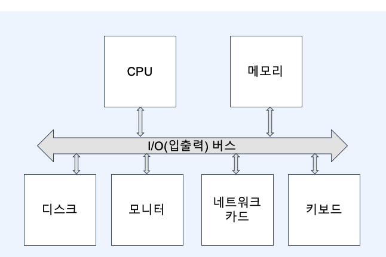
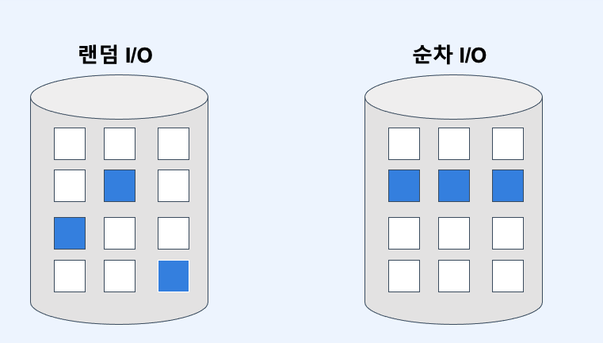
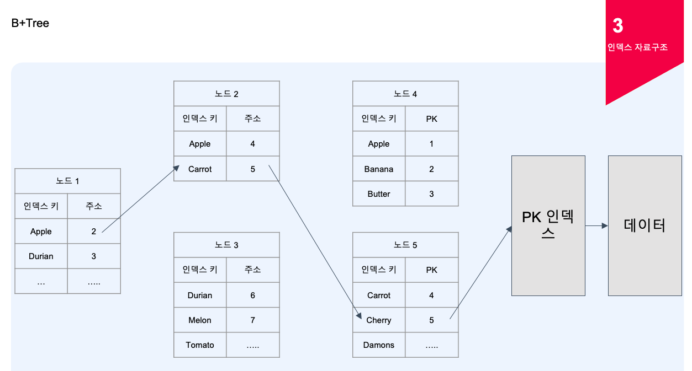

# :book: 백엔드 개발자를 위한 대용량 데이터 & 트래픽 처리

## :pushpin: Chapter 05. 조회 최적화를 위한 인덱스 이해하기
### 데이터베이스 성능 핵심

#### 컴퓨터 구조 

### 메모리 디스크 비교 
|     |메모리|디스크|
|-----|---|---|
| 속도  |빠름|느림|
|영속성|전원이 공급되지 않으면 휘발|영속성이 있음|
|가격|비쌈|저렴함|

- 데이터베이스의 데이터는 결국 `디스크`에 저장된다.
- 디스크는 메모리에 비해 훨씬 느리다.
- 결국 데이터베이스 성능에 핵심은 `디스크 I/O (접근)`을 `최소화`하는 것

### 디스크 접근은 어떻게 줄일 수 있을까?
- 메모리에 올라온 데이터로 최대한 요청을 처리하는 것
  - 메모리 캐시 히트율을 높이는 것
- 심지어 쓰기도 곧 바로 디스크에 쓰지 않고 메모리에 쓴다.
- 메모리에 데이터 유실을 고려해 WAL (Write Ahead Log)를 사용

### 데이터베이스 성능 핵심

- 대부분의 트랜잭션은 무작위하게 Write가 발생
- 이를 지연시켜 랜덤 I/O 횟수를 줄이는 대신 순차적 I/O를 발생시켜 정합성 유지
- 결국 데이터베이스 성능에 핵심은 `디스크의 랜덤 I/O (접근)을 최소화`하는 것

### 인덱스의 기본 동작
- `인덱스`는 정렬된 자료구조, 이를 통해 탐색 범위를 최소화

### 나이가 가장 어린 사람의 데이터를 찾고 싶다
- 전체 데이터를 다 봐야함... 인덱스가 있다면?

- 데이터가 나이 순으로 정렬되어 있어 하나만 조회하면 됨
- `인덱스`도 `테이블`이다!
- 인덱스의 핵심은 탐색(검색) 범위를 최소화 하는 것 

### 인덱스 자료구조
- 인덱스의 핵심은 탐색(검색) 범위를 최소화 하는 것
- 검색이 빠른 자료구조들은 어떤 것이 있을까?
- Hash Map, List, Binary Search Tree ...

### Hash Map
- 단건 검색 속도 O(1)
- 그러나 범위 탐색은 O(N)
- 전방 일치 탐색 불가 ex) like 'AB%'

### List
- 정렬되지 않은 리스트의 탐색은 O(N)
- 정렬된 리스트의 탐색은 O(logN)
- 정렬되지 않은 리스트의 정렬 시간 복잡도는 O(N) ~ O(N*logN)
- 삽입/삭제 비용이 매우 높음

### Tree
- 트리 높이에 따라 시간 복잡도가 결정됨
- 트리의 높이를 최소화하는 것이 중요!
- 한쪽으로 노드가 치우치지 않도록 균형을 잡아주는 트리 사용
  - ex) Red-Black Tree, B+Tree

### B+ Tree
- 삽입/삭제 시 항상 균형을 이룸
- 하나의 노드가 여러 개의 자식 노드를 가질 수 있음
- 리프노드에만 데이터 존재
  - 연속적인 데이터 접근 시 유리

### 만약 Cherry를 검색한다면?
