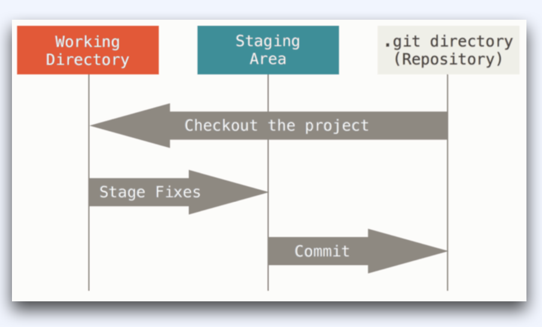

# :book: 백엔드 개발자를 위한 대용량 데이터 & 트래픽 처리
## :pushpin: Part 5-1. 스타트업 초기 서비스 개발

### :seedling: 버전관리 - Git, Github 이론 I
### 1. 버전 관리(VCS)의 이해
### 버전 관리란?
> 한마디로 파일의 타임머신

- 파일의 변화를 기록 (변경점 관리)
- 복구, 특정 시점의 파일을 가져온다.
- 수정된 내용을 비교 가능하다.
- 추적이 가능하다.

### 전통적인(?) 버전 관리
- 압축(zip)
- 날짜별 파일 또는 디렉토리

### 버전 관리 도구의 형태
- 로컬
  - 간단한 형태의 로컬 버전 관리 DB
- 중앙 집중식
  - CVS
  - Subversion
- 분산
  - Git

### Git이란?
- 분산 버전 관리 시스템
- 리누스 토발즈와 다른 커널 개발자
- 리눅스 커널 개발에 사용(2005년)
- 무료, 오픈소스
- 모든 OS지원
- 사실상 업계 표준

### Git의 특징
- 작고 빠르다
- 추적
- 브랜치와 머지
- 변경 이력
- 분산 버전 관리

### Git의 버전 관리 개념
기본적으로 **3단계** 개념
- 워킹 디렉토리(작업 디렉토리)
- 스테이징 영역: 단순한 파일을 지칭, 커밋할 파일의 정보 저장 (인덱스)
- Git 디렉토리: 프로젝트의 메타 정보, 객체 데이터베이스


### Github란?
- 2008년 호스팅 시작
- Git을 이용하는 프로젝트들의 원격 저장소
- 2018년 마이크로소프트에 인수
- 공개 저장소 제공 (Public)
- 개인 저장소 제공 (Private)

### Github 특징
- 원격 저장소 및 호스팅
- 비공개 저장소, 공개 저장소
- 빌드 및 배포 자동화
- 프로젝트 관리 기능
- 이슈 관리 기능
- 위키 제공
- 정적 페이지 호스팅
- 코드 조각

### Github에 저장소 생성하기
- Repository name
- Public or Private
- 버전 관리 무시 (.gitignore)

### Git 기초
- 로컬에서 명령 싫행: 대부분의 명령은 다른 서버가 필요하지 않다.
  - 모든 히스토리가 로컬 저장소에 존재
  - 이력 조회
  - 파일 비교
  - 오프라인 상태 
- 무결성: 체크섬으로 데이터를 관리, 40자 길이의 16진수 문자열
  - 기본적인(Atomic) 데이터 단위
  - SHA-1 해시
  - 모든 것을 해시로 식별
  - 커밋 = 해시 = 스냅샷
  - 6d941b22184d0968f3eeaa83c5ae34bd719ce816

### Git 버전관리 흐름
- **Committed**: 로컬 Git 데이터베이스에 안전하게 저장
- **Modified**: 수정한 파일을 아직 로컬 데이터베이스에 커밋하지 않은 것
- **Staged**: 현재 수정한 파일을 곧 커밋


### Git 용어
- 워킹 디렉토리(Working Directory)
  - 현재 깃으로 버전 관리를 시작한 폴더(프로젝트)
- 스테이징 영역
  - 깃에서 커밋(저장)을 하기 전에 준비를 해 둔 영역
- 리포지토리(Repository)
  - 깃 저장소



### 기본적인 Git 명령어
- Git 지역 저장소 생성: git init
- GIt 설정: git config
- Git 변경 관리
  - git add
  - git status
  - git commit
  - git reset
- 변경 이력
  - git log

### 커밋 (Commit)
- 변경 작업 완료 -> 준비 -> **버전 관리에 저장**
- 변경 사항을 스냅샷으로 저장
- 해시값이 생성됨
- 체크섬
- 6d941b22184d0968f3eeaa83c5ae34bd719ce816
- 6d941b22

### HEAD
- 커밋이 많아지면 어디에 위치하고 있는지 포인터가 필요
- 작업 트리 마지막 커밋을 가르키는 포인터
- 현재 작업 중인 커밋

### 체크아웃(Checkout)
- 작업할 브랜치 지정, 헤드의 위치를 변경
- 현재 작업 브랜치의 HEAD 위치를 변경한다.

```
$ git checkout [브랜치명 or 커밋의 해시]
$ git checkout c1
$ git checkout 6d941b22
```

### 상대 참조
- 많은 커밋을 어떻게 참조할까? 작업 위치를 변경하는 방법은?
- 깃은 커밋 단위를 해시로 관리
- 사람이 알아보기 힘들다
- 상대적인 참조 제공
  - 캐럿(^)
  - 틸드(~)

### 상대참조 연산자: ^(캐럿)
부모 커밋을 나타내는 기호
- 캐럿 1개(^): 바로 1단계 부모 커밋
- 캐럿 2개(^^): 부모 커밋의 부모 커밋

```text
$ git checkout main^   -- 한 단계 부모 커밋으로 이동
$ git checkout main^^  -- 두 단계 부모 커밋으로 이동
```

### 상대참조 연산자: ~(틸드)
주어진 숫자만큼 상위 커밋으로 헤드 포인터 이동
- ~1: 1단계 부모 커밋
- ~2: 2단계 부모 커밋

```text
$ git checkout main~1 -- 1단계 부모 커밋으로 이동
$ git checkout main~3 -- 3단계 부모 커밋으로 이동
```